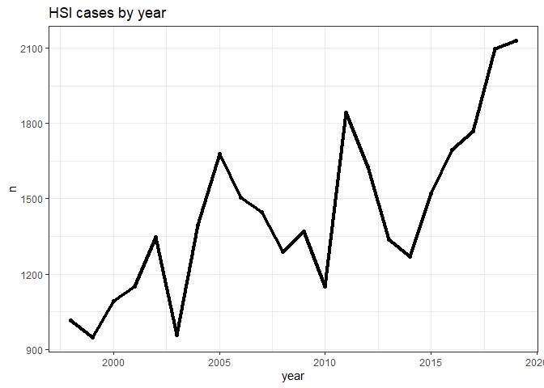
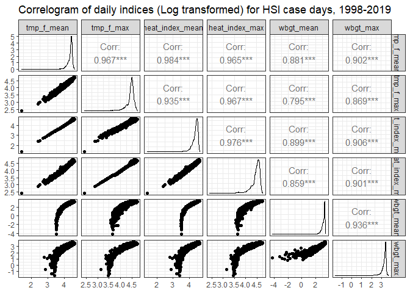
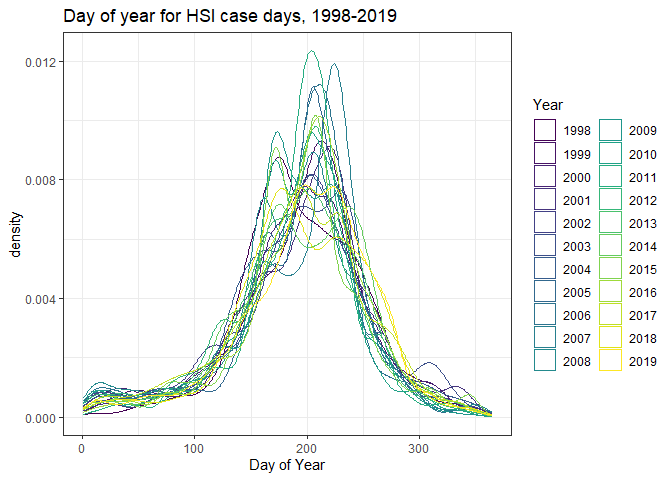
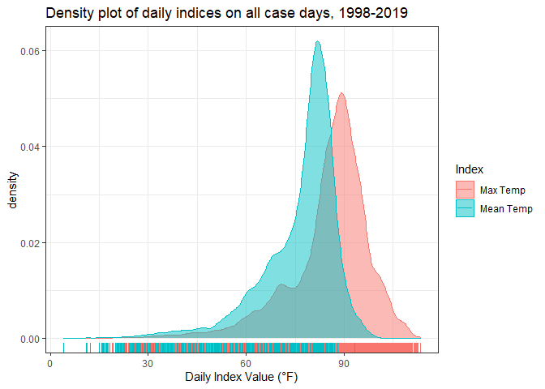

```r
daily_indices <- read_rds(file = "data/daily_indices.rds")


# daily_indices <- read_rds(file = "E:/data/daily_indices.rds") %>% 
#   rename(date = `lubridate::date(local_dttm)`) %>% 
#   mutate(wbgt_f_mean = weathermetrics::celsius.to.fahrenheit(wbgt_u_mean),
#          installation = recode(installation, 
#                 `pensacola_nas` = "pensacola",
#                 `portsmouth_nmc` = "portsmouth"))

# write_rds(daily_indices, file = "data/daily_indices.rds")


cc_exposure_df <-
  read_rds(file = "data/cc_exposure_df.rds")

# cc_exposure_df <-
#   read_rds(file = "E:/data/cc_exposure_df.rds") %>% 
#   mutate(wbgt_f_mean = weathermetrics::celsius.to.fahrenheit(wbgt_u_mean))


cc_exposure_df %>% 
  count(installation_name) %>% View() #24 installations


# cc_exposure_df <-
#   cc_exposure_df %>% 
#      mutate(installation_name = as_factor(installation_name),
#        installation_name = recode(installation_name,
#         "mcb_camp_lejeune" = "camp_lejeune",
#         "mcb_camp_pendleton" = "camp_pendleton",
#         "fort_benning_ga" = "fort_benning",
#         "fort_sam_houston" = "jbsa",
#         "mcrd_beaufort_parris_island" = "parris_island",
#         "mcb_quantico" = "quantico",
#         "twentynine_palms_main_base" = "twentynine_palms")) 


# write_rds(cc_exposure_df, file = "data/cc_exposure_df.rds")
# write_rds(daily_indices, file = "data/daily_indices.rds")
```


### Counts by service - installation

```r
base_service_counts <-
  cc_exposure_df %>% 
    count(installation_name, service) %>% 
    spread(service, n, fill = 0) 


# rank case occurrence by service for each installation; filter top

base_service_rank <-
  cc_exposure_df %>% 
    count(installation_name, service) %>% 
    group_by(installation_name) %>% 
    mutate(rank = rank(-n)) %>% 
    filter(rank == 1)

base_service_df <-
  base_service_counts %>% 
    right_join(base_service_rank %>% 
                 dplyr::select(installation_name, service), by = "installation_name") 


base_service_df %>% 
  count(service)
```

```
## # A tibble: 4 x 2
##   service     n
##   <chr>   <int>
## 1 A          14
## 2 F           2
## 3 M           6
## 4 N           2
```

### Geographic / climate region

https://www.ncdc.noaa.gov/monitoring-references/maps/us-climate-regions.php

Through climate analysis, National Centers for Environmental Information scientists have identified nine climatically consistent regions within the contiguous United States which are useful for putting current climate anomalies into a historical perspective (Karl and Koss, 1984).


```r
base_service_df$installation_name
```

```
##  [1] fort_benning       fort_bragg         camp_lejeune       parris_island     
##  [5] fort_campbell      fort_polk          fort_jackson       camp_pendleton    
##  [9] fort_hood          mcrd_san_diego     fort_stewart       jbsa              
## [13] quantico           twentynine_palms   fort_sill          fort_leonard_wood 
## [17] fort_riley         ntc_and_fort_irwin fort_knox          fort_bliss        
## [21] portsmouth         pensacola          fort_gordon        eglin_afb         
## 24 Levels: fort_benning fort_bragg camp_lejeune parris_island ... eglin_afb
```

```r
# Assign U.S. Climate regions

## 1st column
installation_name <- base_service_df$installation_name 
## 2nd column
region <- c("Southeast", "Southeast", "Southeast", "Southeast", "Ohio Valley", "South", 
            "Southeast", "West", "South", "West", "Southeast", "South",
            "Southeast", "West", "South", "Ohio Valley", "South", "West",
            "Ohio Valley", "South", "Southeast", "Southeast", "Southeast", "Southeast"
            )

climate_regions <- data.frame(installation_name, region) %>% 
  as_tibble()
  

base_service_df <- 
  base_service_df %>% 
    right_join(climate_regions, by = "installation_name") 


base_service_df <-
  base_service_df %>% 
    mutate(service = recode(service,
          "A" = "Army",
          "C" = "Coast Guard",
          "F" = "Air Force",
          "M" = "Marine Corps",
          "N" = "Navy"))


#write_rds(base_service_df, file = "data/base_service_df.rds")
  


base_service_df %>% 
  ggplot(aes(region)) +
    geom_bar() +
    theme_bw()
```

<!-- -->

```r
base_service_df %>% 
  ggplot(aes(region, fill = service)) +
    geom_bar(position = position_dodge()) +
    theme_bw()
```

<!-- -->

```r
# Cross-tab service and region
base_service_df %>% 
  group_by(service, region) %>% 
  summarise(n = n()) %>% 
  spread(region, n)
```

```
## `summarise()` regrouping output by 'service' (override with `.groups` argument)
```

```
## # A tibble: 4 x 5
## # Groups:   service [4]
##   service      `Ohio Valley` South Southeast  West
##   <chr>                <int> <int>     <int> <int>
## 1 Air Force               NA     1         1    NA
## 2 Army                     3     5         5     1
## 3 Marine Corps            NA    NA         3     3
## 4 Navy                    NA    NA         2    NA
```

```r
base_service_df %>% 
  group_by(service, region) %>% 
  summarise(n = n()) %>% 
  spread(region, n) %>% 
  knitr::kable()
```

```
## `summarise()` regrouping output by 'service' (override with `.groups` argument)
```


|service      | Ohio Valley| South| Southeast| West|
|:------------|-----------:|-----:|---------:|----:|
|Air Force    |          NA|     1|         1|   NA|
|Army         |           3|     5|         5|    1|
|Marine Corps |          NA|    NA|         3|    3|
|Navy         |          NA|    NA|         2|   NA|


## Outcome table

```r
to_table1 <-
  cc_exposure_df %>% 
    filter(case == 1) %>% 
    dplyr::select(installation_name, source, age, sex, race_ethnic, service, grade, hsi) %>% 
       mutate(service = recode(service,
            "A" = "Army",
            "C" = "Coast Guard",
            "F" = "Air Force",
            "M" = "Marine Corps",
            "N" = "Navy"),
            source = recode(source,
            "INPATIENT" = "In-Patient",
            "OUTPATIENT" = "Out-Patient",
            "RME" = "Reportable Event"),
            hsi = recode(hsi,
            "heat_exhaustion" = "Heat Exhaustion",
            "heat_stroke" = "Heat Stroke"),
            sex = recode(sex,
            "F" = "Female",
            "M" = "Male",
            "Z" = "Unknown")
            ) %>% 
  left_join(climate_regions, by = "installation_name") %>% 
  mutate_if(is.character, as.factor) %>% 
            mutate(age = fct_relevel(age, ">=40", after = Inf))


label(to_table1$hsi) <- "HSI Diagnosis"
label(to_table1$age) <- "Age Group"
label(to_table1$sex) <- "Sex"
label(to_table1$race_ethnic) <- "Race/Ethnicity"
label(to_table1$grade) <- "Grade Group"
label(to_table1$service) <- "Service Branch"
label(to_table1$region) <- "NOAA NCEI Climate Region"


table1::table1(~ hsi + sex + age + sex + grade + race_ethnic  | source, data = to_table1)
```

<!--html_preserve--><div class="Rtable1"><table class="Rtable1">
<thead>
<tr>
<th class='rowlabel firstrow lastrow'></th>
<th class='firstrow lastrow'><span class='stratlabel'>In-Patient<br><span class='stratn'>(N=3274)</span></span></th>
<th class='firstrow lastrow'><span class='stratlabel'>Out-Patient<br><span class='stratn'>(N=17856)</span></span></th>
<th class='firstrow lastrow'><span class='stratlabel'>Reportable Event<br><span class='stratn'>(N=10512)</span></span></th>
<th class='firstrow lastrow'><span class='stratlabel'>Overall<br><span class='stratn'>(N=31642)</span></span></th>
</tr>
</thead>
<tbody>
<tr>
<td class='rowlabel firstrow'><span class='varlabel'>HSI Diagnosis</span></td>
<td class='firstrow'></td>
<td class='firstrow'></td>
<td class='firstrow'></td>
<td class='firstrow'></td>
</tr>
<tr>
<td class='rowlabel'>Heat Exhaustion</td>
<td>1328 (40.6%)</td>
<td>14902 (83.5%)</td>
<td>8983 (85.5%)</td>
<td>25213 (79.7%)</td>
</tr>
<tr>
<td class='rowlabel lastrow'>Heat Stroke</td>
<td class='lastrow'>1946 (59.4%)</td>
<td class='lastrow'>2954 (16.5%)</td>
<td class='lastrow'>1529 (14.5%)</td>
<td class='lastrow'>6429 (20.3%)</td>
</tr>
<tr>
<td class='rowlabel firstrow'><span class='varlabel'>Sex</span></td>
<td class='firstrow'></td>
<td class='firstrow'></td>
<td class='firstrow'></td>
<td class='firstrow'></td>
</tr>
<tr>
<td class='rowlabel'>Female</td>
<td>207 (6.3%)</td>
<td>2693 (15.1%)</td>
<td>1852 (17.6%)</td>
<td>4752 (15.0%)</td>
</tr>
<tr>
<td class='rowlabel'>Male</td>
<td>3066 (93.6%)</td>
<td>15162 (84.9%)</td>
<td>8660 (82.4%)</td>
<td>26888 (85.0%)</td>
</tr>
<tr>
<td class='rowlabel lastrow'>Unknown</td>
<td class='lastrow'>1 (0.0%)</td>
<td class='lastrow'>1 (0.0%)</td>
<td class='lastrow'>0 (0%)</td>
<td class='lastrow'>2 (0.0%)</td>
</tr>
<tr>
<td class='rowlabel firstrow'><span class='varlabel'>Age Group</span></td>
<td class='firstrow'></td>
<td class='firstrow'></td>
<td class='firstrow'></td>
<td class='firstrow'></td>
</tr>
<tr>
<td class='rowlabel'><20</td>
<td>683 (20.9%)</td>
<td>4488 (25.1%)</td>
<td>2848 (27.1%)</td>
<td>8019 (25.3%)</td>
</tr>
<tr>
<td class='rowlabel'>20-24</td>
<td>1377 (42.1%)</td>
<td>7699 (43.1%)</td>
<td>4652 (44.3%)</td>
<td>13728 (43.4%)</td>
</tr>
<tr>
<td class='rowlabel'>25-29</td>
<td>657 (20.1%)</td>
<td>3182 (17.8%)</td>
<td>1779 (16.9%)</td>
<td>5618 (17.8%)</td>
</tr>
<tr>
<td class='rowlabel'>30-34</td>
<td>340 (10.4%)</td>
<td>1381 (7.7%)</td>
<td>737 (7.0%)</td>
<td>2458 (7.8%)</td>
</tr>
<tr>
<td class='rowlabel'>35-39</td>
<td>141 (4.3%)</td>
<td>686 (3.8%)</td>
<td>334 (3.2%)</td>
<td>1161 (3.7%)</td>
</tr>
<tr>
<td class='rowlabel'>>=40</td>
<td>75 (2.3%)</td>
<td>417 (2.3%)</td>
<td>158 (1.5%)</td>
<td>650 (2.1%)</td>
</tr>
<tr>
<td class='rowlabel lastrow'>Missing</td>
<td class='lastrow'>1 (0.0%)</td>
<td class='lastrow'>3 (0.0%)</td>
<td class='lastrow'>4 (0.0%)</td>
<td class='lastrow'>8 (0.0%)</td>
</tr>
<tr>
<td class='rowlabel firstrow'><span class='varlabel'>Grade Group</span></td>
<td class='firstrow'></td>
<td class='firstrow'></td>
<td class='firstrow'></td>
<td class='firstrow'></td>
</tr>
<tr>
<td class='rowlabel'>E1-E4</td>
<td>2173 (66.4%)</td>
<td>13183 (73.8%)</td>
<td>8276 (78.7%)</td>
<td>23632 (74.7%)</td>
</tr>
<tr>
<td class='rowlabel'>E5-E9</td>
<td>644 (19.7%)</td>
<td>3122 (17.5%)</td>
<td>1606 (15.3%)</td>
<td>5372 (17.0%)</td>
</tr>
<tr>
<td class='rowlabel'>O1-O3/W1-W3</td>
<td>420 (12.8%)</td>
<td>1413 (7.9%)</td>
<td>580 (5.5%)</td>
<td>2413 (7.6%)</td>
</tr>
<tr>
<td class='rowlabel'>O4-O10/W4-W5</td>
<td>37 (1.1%)</td>
<td>137 (0.8%)</td>
<td>50 (0.5%)</td>
<td>224 (0.7%)</td>
</tr>
<tr>
<td class='rowlabel lastrow'>Missing</td>
<td class='lastrow'>0 (0%)</td>
<td class='lastrow'>1 (0.0%)</td>
<td class='lastrow'>0 (0%)</td>
<td class='lastrow'>1 (0.0%)</td>
</tr>
<tr>
<td class='rowlabel firstrow'><span class='varlabel'>Race/Ethnicity</span></td>
<td class='firstrow'></td>
<td class='firstrow'></td>
<td class='firstrow'></td>
<td class='firstrow'></td>
</tr>
<tr>
<td class='rowlabel'>American Indian/Alaskan Native</td>
<td>35 (1.1%)</td>
<td>112 (0.6%)</td>
<td>113 (1.1%)</td>
<td>260 (0.8%)</td>
</tr>
<tr>
<td class='rowlabel'>Asian/Pacific Islander</td>
<td>162 (4.9%)</td>
<td>756 (4.2%)</td>
<td>519 (4.9%)</td>
<td>1437 (4.5%)</td>
</tr>
<tr>
<td class='rowlabel'>Hispanic</td>
<td>363 (11.1%)</td>
<td>2074 (11.6%)</td>
<td>1221 (11.6%)</td>
<td>3658 (11.6%)</td>
</tr>
<tr>
<td class='rowlabel'>Non-Hispanic Black</td>
<td>575 (17.6%)</td>
<td>3076 (17.2%)</td>
<td>2067 (19.7%)</td>
<td>5718 (18.1%)</td>
</tr>
<tr>
<td class='rowlabel'>Non-Hispanic White</td>
<td>2044 (62.4%)</td>
<td>11143 (62.4%)</td>
<td>6303 (60.0%)</td>
<td>19490 (61.6%)</td>
</tr>
<tr>
<td class='rowlabel'>Other</td>
<td>42 (1.3%)</td>
<td>357 (2.0%)</td>
<td>149 (1.4%)</td>
<td>548 (1.7%)</td>
</tr>
<tr>
<td class='rowlabel lastrow'>Unknown</td>
<td class='lastrow'>53 (1.6%)</td>
<td class='lastrow'>338 (1.9%)</td>
<td class='lastrow'>140 (1.3%)</td>
<td class='lastrow'>531 (1.7%)</td>
</tr>
</tbody>
</table>
</div><!--/html_preserve-->

```r
table1::table1(~ hsi + sex + age + sex + grade   | source, data = to_table1)  
```

<!--html_preserve--><div class="Rtable1"><table class="Rtable1">
<thead>
<tr>
<th class='rowlabel firstrow lastrow'></th>
<th class='firstrow lastrow'><span class='stratlabel'>In-Patient<br><span class='stratn'>(N=3274)</span></span></th>
<th class='firstrow lastrow'><span class='stratlabel'>Out-Patient<br><span class='stratn'>(N=17856)</span></span></th>
<th class='firstrow lastrow'><span class='stratlabel'>Reportable Event<br><span class='stratn'>(N=10512)</span></span></th>
<th class='firstrow lastrow'><span class='stratlabel'>Overall<br><span class='stratn'>(N=31642)</span></span></th>
</tr>
</thead>
<tbody>
<tr>
<td class='rowlabel firstrow'><span class='varlabel'>HSI Diagnosis</span></td>
<td class='firstrow'></td>
<td class='firstrow'></td>
<td class='firstrow'></td>
<td class='firstrow'></td>
</tr>
<tr>
<td class='rowlabel'>Heat Exhaustion</td>
<td>1328 (40.6%)</td>
<td>14902 (83.5%)</td>
<td>8983 (85.5%)</td>
<td>25213 (79.7%)</td>
</tr>
<tr>
<td class='rowlabel lastrow'>Heat Stroke</td>
<td class='lastrow'>1946 (59.4%)</td>
<td class='lastrow'>2954 (16.5%)</td>
<td class='lastrow'>1529 (14.5%)</td>
<td class='lastrow'>6429 (20.3%)</td>
</tr>
<tr>
<td class='rowlabel firstrow'><span class='varlabel'>Sex</span></td>
<td class='firstrow'></td>
<td class='firstrow'></td>
<td class='firstrow'></td>
<td class='firstrow'></td>
</tr>
<tr>
<td class='rowlabel'>Female</td>
<td>207 (6.3%)</td>
<td>2693 (15.1%)</td>
<td>1852 (17.6%)</td>
<td>4752 (15.0%)</td>
</tr>
<tr>
<td class='rowlabel'>Male</td>
<td>3066 (93.6%)</td>
<td>15162 (84.9%)</td>
<td>8660 (82.4%)</td>
<td>26888 (85.0%)</td>
</tr>
<tr>
<td class='rowlabel lastrow'>Unknown</td>
<td class='lastrow'>1 (0.0%)</td>
<td class='lastrow'>1 (0.0%)</td>
<td class='lastrow'>0 (0%)</td>
<td class='lastrow'>2 (0.0%)</td>
</tr>
<tr>
<td class='rowlabel firstrow'><span class='varlabel'>Age Group</span></td>
<td class='firstrow'></td>
<td class='firstrow'></td>
<td class='firstrow'></td>
<td class='firstrow'></td>
</tr>
<tr>
<td class='rowlabel'><20</td>
<td>683 (20.9%)</td>
<td>4488 (25.1%)</td>
<td>2848 (27.1%)</td>
<td>8019 (25.3%)</td>
</tr>
<tr>
<td class='rowlabel'>20-24</td>
<td>1377 (42.1%)</td>
<td>7699 (43.1%)</td>
<td>4652 (44.3%)</td>
<td>13728 (43.4%)</td>
</tr>
<tr>
<td class='rowlabel'>25-29</td>
<td>657 (20.1%)</td>
<td>3182 (17.8%)</td>
<td>1779 (16.9%)</td>
<td>5618 (17.8%)</td>
</tr>
<tr>
<td class='rowlabel'>30-34</td>
<td>340 (10.4%)</td>
<td>1381 (7.7%)</td>
<td>737 (7.0%)</td>
<td>2458 (7.8%)</td>
</tr>
<tr>
<td class='rowlabel'>35-39</td>
<td>141 (4.3%)</td>
<td>686 (3.8%)</td>
<td>334 (3.2%)</td>
<td>1161 (3.7%)</td>
</tr>
<tr>
<td class='rowlabel'>>=40</td>
<td>75 (2.3%)</td>
<td>417 (2.3%)</td>
<td>158 (1.5%)</td>
<td>650 (2.1%)</td>
</tr>
<tr>
<td class='rowlabel lastrow'>Missing</td>
<td class='lastrow'>1 (0.0%)</td>
<td class='lastrow'>3 (0.0%)</td>
<td class='lastrow'>4 (0.0%)</td>
<td class='lastrow'>8 (0.0%)</td>
</tr>
<tr>
<td class='rowlabel firstrow'><span class='varlabel'>Grade Group</span></td>
<td class='firstrow'></td>
<td class='firstrow'></td>
<td class='firstrow'></td>
<td class='firstrow'></td>
</tr>
<tr>
<td class='rowlabel'>E1-E4</td>
<td>2173 (66.4%)</td>
<td>13183 (73.8%)</td>
<td>8276 (78.7%)</td>
<td>23632 (74.7%)</td>
</tr>
<tr>
<td class='rowlabel'>E5-E9</td>
<td>644 (19.7%)</td>
<td>3122 (17.5%)</td>
<td>1606 (15.3%)</td>
<td>5372 (17.0%)</td>
</tr>
<tr>
<td class='rowlabel'>O1-O3/W1-W3</td>
<td>420 (12.8%)</td>
<td>1413 (7.9%)</td>
<td>580 (5.5%)</td>
<td>2413 (7.6%)</td>
</tr>
<tr>
<td class='rowlabel'>O4-O10/W4-W5</td>
<td>37 (1.1%)</td>
<td>137 (0.8%)</td>
<td>50 (0.5%)</td>
<td>224 (0.7%)</td>
</tr>
<tr>
<td class='rowlabel lastrow'>Missing</td>
<td class='lastrow'>0 (0%)</td>
<td class='lastrow'>1 (0.0%)</td>
<td class='lastrow'>0 (0%)</td>
<td class='lastrow'>1 (0.0%)</td>
</tr>
</tbody>
</table>
</div><!--/html_preserve-->

```r
table1::table1(~ service + region + race_ethnic | source, data = to_table1)
```

<!--html_preserve--><div class="Rtable1"><table class="Rtable1">
<thead>
<tr>
<th class='rowlabel firstrow lastrow'></th>
<th class='firstrow lastrow'><span class='stratlabel'>In-Patient<br><span class='stratn'>(N=3274)</span></span></th>
<th class='firstrow lastrow'><span class='stratlabel'>Out-Patient<br><span class='stratn'>(N=17856)</span></span></th>
<th class='firstrow lastrow'><span class='stratlabel'>Reportable Event<br><span class='stratn'>(N=10512)</span></span></th>
<th class='firstrow lastrow'><span class='stratlabel'>Overall<br><span class='stratn'>(N=31642)</span></span></th>
</tr>
</thead>
<tbody>
<tr>
<td class='rowlabel firstrow'><span class='varlabel'>Service Branch</span></td>
<td class='firstrow'></td>
<td class='firstrow'></td>
<td class='firstrow'></td>
<td class='firstrow'></td>
</tr>
<tr>
<td class='rowlabel'>Air Force</td>
<td>92 (2.8%)</td>
<td>770 (4.3%)</td>
<td>102 (1.0%)</td>
<td>964 (3.0%)</td>
</tr>
<tr>
<td class='rowlabel'>Army</td>
<td>2175 (66.4%)</td>
<td>9959 (55.8%)</td>
<td>8011 (76.2%)</td>
<td>20145 (63.7%)</td>
</tr>
<tr>
<td class='rowlabel'>Coast Guard</td>
<td>1 (0.0%)</td>
<td>39 (0.2%)</td>
<td>2 (0.0%)</td>
<td>42 (0.1%)</td>
</tr>
<tr>
<td class='rowlabel'>Marine Corps</td>
<td>867 (26.5%)</td>
<td>6180 (34.6%)</td>
<td>2157 (20.5%)</td>
<td>9204 (29.1%)</td>
</tr>
<tr>
<td class='rowlabel lastrow'>Navy</td>
<td class='lastrow'>139 (4.2%)</td>
<td class='lastrow'>908 (5.1%)</td>
<td class='lastrow'>240 (2.3%)</td>
<td class='lastrow'>1287 (4.1%)</td>
</tr>
<tr>
<td class='rowlabel firstrow'><span class='varlabel'>NOAA NCEI Climate Region</span></td>
<td class='firstrow'></td>
<td class='firstrow'></td>
<td class='firstrow'></td>
<td class='firstrow'></td>
</tr>
<tr>
<td class='rowlabel'>Ohio Valley</td>
<td>266 (8.1%)</td>
<td>1726 (9.7%)</td>
<td>869 (8.3%)</td>
<td>2861 (9.0%)</td>
</tr>
<tr>
<td class='rowlabel'>South</td>
<td>458 (14.0%)</td>
<td>2899 (16.2%)</td>
<td>1999 (19.0%)</td>
<td>5356 (16.9%)</td>
</tr>
<tr>
<td class='rowlabel'>Southeast</td>
<td>2034 (62.1%)</td>
<td>10695 (59.9%)</td>
<td>7053 (67.1%)</td>
<td>19782 (62.5%)</td>
</tr>
<tr>
<td class='rowlabel lastrow'>West</td>
<td class='lastrow'>516 (15.8%)</td>
<td class='lastrow'>2536 (14.2%)</td>
<td class='lastrow'>591 (5.6%)</td>
<td class='lastrow'>3643 (11.5%)</td>
</tr>
<tr>
<td class='rowlabel firstrow'><span class='varlabel'>Race/Ethnicity</span></td>
<td class='firstrow'></td>
<td class='firstrow'></td>
<td class='firstrow'></td>
<td class='firstrow'></td>
</tr>
<tr>
<td class='rowlabel'>American Indian/Alaskan Native</td>
<td>35 (1.1%)</td>
<td>112 (0.6%)</td>
<td>113 (1.1%)</td>
<td>260 (0.8%)</td>
</tr>
<tr>
<td class='rowlabel'>Asian/Pacific Islander</td>
<td>162 (4.9%)</td>
<td>756 (4.2%)</td>
<td>519 (4.9%)</td>
<td>1437 (4.5%)</td>
</tr>
<tr>
<td class='rowlabel'>Hispanic</td>
<td>363 (11.1%)</td>
<td>2074 (11.6%)</td>
<td>1221 (11.6%)</td>
<td>3658 (11.6%)</td>
</tr>
<tr>
<td class='rowlabel'>Non-Hispanic Black</td>
<td>575 (17.6%)</td>
<td>3076 (17.2%)</td>
<td>2067 (19.7%)</td>
<td>5718 (18.1%)</td>
</tr>
<tr>
<td class='rowlabel'>Non-Hispanic White</td>
<td>2044 (62.4%)</td>
<td>11143 (62.4%)</td>
<td>6303 (60.0%)</td>
<td>19490 (61.6%)</td>
</tr>
<tr>
<td class='rowlabel'>Other</td>
<td>42 (1.3%)</td>
<td>357 (2.0%)</td>
<td>149 (1.4%)</td>
<td>548 (1.7%)</td>
</tr>
<tr>
<td class='rowlabel lastrow'>Unknown</td>
<td class='lastrow'>53 (1.6%)</td>
<td class='lastrow'>338 (1.9%)</td>
<td class='lastrow'>140 (1.3%)</td>
<td class='lastrow'>531 (1.7%)</td>
</tr>
</tbody>
</table>
</div><!--/html_preserve-->

```r
table1::table1(~ factor(hsi) + factor(age) + factor(sex) + 
               factor(race_ethnic) + factor(grade) | factor(source), data = to_table1)
```

<!--html_preserve--><div class="Rtable1"><table class="Rtable1">
<thead>
<tr>
<th class='rowlabel firstrow lastrow'></th>
<th class='firstrow lastrow'><span class='stratlabel'>In-Patient<br><span class='stratn'>(N=3274)</span></span></th>
<th class='firstrow lastrow'><span class='stratlabel'>Out-Patient<br><span class='stratn'>(N=17856)</span></span></th>
<th class='firstrow lastrow'><span class='stratlabel'>Reportable Event<br><span class='stratn'>(N=10512)</span></span></th>
<th class='firstrow lastrow'><span class='stratlabel'>Overall<br><span class='stratn'>(N=31642)</span></span></th>
</tr>
</thead>
<tbody>
<tr>
<td class='rowlabel firstrow'><span class='varlabel'>factor(hsi)</span></td>
<td class='firstrow'></td>
<td class='firstrow'></td>
<td class='firstrow'></td>
<td class='firstrow'></td>
</tr>
<tr>
<td class='rowlabel'>Heat Exhaustion</td>
<td>1328 (40.6%)</td>
<td>14902 (83.5%)</td>
<td>8983 (85.5%)</td>
<td>25213 (79.7%)</td>
</tr>
<tr>
<td class='rowlabel lastrow'>Heat Stroke</td>
<td class='lastrow'>1946 (59.4%)</td>
<td class='lastrow'>2954 (16.5%)</td>
<td class='lastrow'>1529 (14.5%)</td>
<td class='lastrow'>6429 (20.3%)</td>
</tr>
<tr>
<td class='rowlabel firstrow'><span class='varlabel'>factor(age)</span></td>
<td class='firstrow'></td>
<td class='firstrow'></td>
<td class='firstrow'></td>
<td class='firstrow'></td>
</tr>
<tr>
<td class='rowlabel'><20</td>
<td>683 (20.9%)</td>
<td>4488 (25.1%)</td>
<td>2848 (27.1%)</td>
<td>8019 (25.3%)</td>
</tr>
<tr>
<td class='rowlabel'>20-24</td>
<td>1377 (42.1%)</td>
<td>7699 (43.1%)</td>
<td>4652 (44.3%)</td>
<td>13728 (43.4%)</td>
</tr>
<tr>
<td class='rowlabel'>25-29</td>
<td>657 (20.1%)</td>
<td>3182 (17.8%)</td>
<td>1779 (16.9%)</td>
<td>5618 (17.8%)</td>
</tr>
<tr>
<td class='rowlabel'>30-34</td>
<td>340 (10.4%)</td>
<td>1381 (7.7%)</td>
<td>737 (7.0%)</td>
<td>2458 (7.8%)</td>
</tr>
<tr>
<td class='rowlabel'>35-39</td>
<td>141 (4.3%)</td>
<td>686 (3.8%)</td>
<td>334 (3.2%)</td>
<td>1161 (3.7%)</td>
</tr>
<tr>
<td class='rowlabel'>>=40</td>
<td>75 (2.3%)</td>
<td>417 (2.3%)</td>
<td>158 (1.5%)</td>
<td>650 (2.1%)</td>
</tr>
<tr>
<td class='rowlabel lastrow'>Missing</td>
<td class='lastrow'>1 (0.0%)</td>
<td class='lastrow'>3 (0.0%)</td>
<td class='lastrow'>4 (0.0%)</td>
<td class='lastrow'>8 (0.0%)</td>
</tr>
<tr>
<td class='rowlabel firstrow'><span class='varlabel'>factor(sex)</span></td>
<td class='firstrow'></td>
<td class='firstrow'></td>
<td class='firstrow'></td>
<td class='firstrow'></td>
</tr>
<tr>
<td class='rowlabel'>Female</td>
<td>207 (6.3%)</td>
<td>2693 (15.1%)</td>
<td>1852 (17.6%)</td>
<td>4752 (15.0%)</td>
</tr>
<tr>
<td class='rowlabel'>Male</td>
<td>3066 (93.6%)</td>
<td>15162 (84.9%)</td>
<td>8660 (82.4%)</td>
<td>26888 (85.0%)</td>
</tr>
<tr>
<td class='rowlabel lastrow'>Unknown</td>
<td class='lastrow'>1 (0.0%)</td>
<td class='lastrow'>1 (0.0%)</td>
<td class='lastrow'>0 (0%)</td>
<td class='lastrow'>2 (0.0%)</td>
</tr>
<tr>
<td class='rowlabel firstrow'><span class='varlabel'>factor(race_ethnic)</span></td>
<td class='firstrow'></td>
<td class='firstrow'></td>
<td class='firstrow'></td>
<td class='firstrow'></td>
</tr>
<tr>
<td class='rowlabel'>American Indian/Alaskan Native</td>
<td>35 (1.1%)</td>
<td>112 (0.6%)</td>
<td>113 (1.1%)</td>
<td>260 (0.8%)</td>
</tr>
<tr>
<td class='rowlabel'>Asian/Pacific Islander</td>
<td>162 (4.9%)</td>
<td>756 (4.2%)</td>
<td>519 (4.9%)</td>
<td>1437 (4.5%)</td>
</tr>
<tr>
<td class='rowlabel'>Hispanic</td>
<td>363 (11.1%)</td>
<td>2074 (11.6%)</td>
<td>1221 (11.6%)</td>
<td>3658 (11.6%)</td>
</tr>
<tr>
<td class='rowlabel'>Non-Hispanic Black</td>
<td>575 (17.6%)</td>
<td>3076 (17.2%)</td>
<td>2067 (19.7%)</td>
<td>5718 (18.1%)</td>
</tr>
<tr>
<td class='rowlabel'>Non-Hispanic White</td>
<td>2044 (62.4%)</td>
<td>11143 (62.4%)</td>
<td>6303 (60.0%)</td>
<td>19490 (61.6%)</td>
</tr>
<tr>
<td class='rowlabel'>Other</td>
<td>42 (1.3%)</td>
<td>357 (2.0%)</td>
<td>149 (1.4%)</td>
<td>548 (1.7%)</td>
</tr>
<tr>
<td class='rowlabel lastrow'>Unknown</td>
<td class='lastrow'>53 (1.6%)</td>
<td class='lastrow'>338 (1.9%)</td>
<td class='lastrow'>140 (1.3%)</td>
<td class='lastrow'>531 (1.7%)</td>
</tr>
<tr>
<td class='rowlabel firstrow'><span class='varlabel'>factor(grade)</span></td>
<td class='firstrow'></td>
<td class='firstrow'></td>
<td class='firstrow'></td>
<td class='firstrow'></td>
</tr>
<tr>
<td class='rowlabel'>E1-E4</td>
<td>2173 (66.4%)</td>
<td>13183 (73.8%)</td>
<td>8276 (78.7%)</td>
<td>23632 (74.7%)</td>
</tr>
<tr>
<td class='rowlabel'>E5-E9</td>
<td>644 (19.7%)</td>
<td>3122 (17.5%)</td>
<td>1606 (15.3%)</td>
<td>5372 (17.0%)</td>
</tr>
<tr>
<td class='rowlabel'>O1-O3/W1-W3</td>
<td>420 (12.8%)</td>
<td>1413 (7.9%)</td>
<td>580 (5.5%)</td>
<td>2413 (7.6%)</td>
</tr>
<tr>
<td class='rowlabel'>O4-O10/W4-W5</td>
<td>37 (1.1%)</td>
<td>137 (0.8%)</td>
<td>50 (0.5%)</td>
<td>224 (0.7%)</td>
</tr>
<tr>
<td class='rowlabel lastrow'>Missing</td>
<td class='lastrow'>0 (0%)</td>
<td class='lastrow'>1 (0.0%)</td>
<td class='lastrow'>0 (0%)</td>
<td class='lastrow'>1 (0.0%)</td>
</tr>
</tbody>
</table>
</div><!--/html_preserve-->

```r
# Cases over time

cc_exposure_df %>% 
  filter(case == 1) %>% 
  group_by(lubridate::year(date)) %>% 
  count() %>% 
  rename(year = `lubridate::year(date)`) %>% 
  ggplot(aes(x = year, y= n)) +
      geom_point() +
      geom_line(size = 1.5) +
      theme_bw() +
  labs(title = "HSI cases by year",
       x = "year")
```

<!-- -->

```r
cc_exposure_df %>% 
  filter(case == 1) %>% 
  group_by(lubridate::year(date), installation_name) %>% 
  count() %>% 
  rename(year = `lubridate::year(date)`) %>% 
  ggplot(aes(x = year, y = n, colour = installation_name)) +
      geom_point() +
      geom_line(size = 0.8) +
      theme_bw() +
  labs(title = "HSI cases by year",
       x = "year")
```

<!-- -->


## Exposures


## Scatterplot (correlogram) by indices

```r
cc_exposure_df %>% 
    filter(case == 1) %>% 
  dplyr::select(tmp_f_mean, tmp_f_max, heat_index_mean, heat_index_max, wbgt_mean, wbgt_max) %>% 
  GGally::ggpairs(title = "Correlogram of daily indices for HSI case days, 1998-2019") +
    theme_bw()
```

<!-- -->

```r
#ggsave("output/index_correlogram.png")


# Log transformed indices
cc_exposure_df %>% 
    filter(case == 1) %>% 
  dplyr::select(tmp_f_mean, tmp_f_max, heat_index_mean, heat_index_max, wbgt_mean, wbgt_max) %>%
  log(.) %>% 
  GGally::ggpairs(title = "Correlogram of daily indices (Log transformed) for HSI case days, 1998-2019") +
    theme_bw()
```

```
## Warning in FUN(X[[i]], ...): NaNs produced

## Warning in FUN(X[[i]], ...): NaNs produced
```

```
## Warning in ggally_statistic(data = data, mapping = mapping, na.rm = na.rm, :
## Removed 240 rows containing missing values
```

```
## Warning in ggally_statistic(data = data, mapping = mapping, na.rm = na.rm, :
## Removed 62 rows containing missing values
```

```
## Warning in ggally_statistic(data = data, mapping = mapping, na.rm = na.rm, :
## Removed 240 rows containing missing values
```

```
## Warning in ggally_statistic(data = data, mapping = mapping, na.rm = na.rm, :
## Removed 62 rows containing missing values
```

```
## Warning in ggally_statistic(data = data, mapping = mapping, na.rm = na.rm, :
## Removed 240 rows containing missing values
```

```
## Warning in ggally_statistic(data = data, mapping = mapping, na.rm = na.rm, :
## Removed 62 rows containing missing values
```

```
## Warning in ggally_statistic(data = data, mapping = mapping, na.rm = na.rm, :
## Removed 240 rows containing missing values
```

```
## Warning in ggally_statistic(data = data, mapping = mapping, na.rm = na.rm, :
## Removed 62 rows containing missing values
```

```
## Warning: Removed 240 rows containing missing values (geom_point).

## Warning: Removed 240 rows containing missing values (geom_point).

## Warning: Removed 240 rows containing missing values (geom_point).

## Warning: Removed 240 rows containing missing values (geom_point).
```

```
## Warning: Removed 240 rows containing non-finite values (stat_density).
```

```
## Warning in ggally_statistic(data = data, mapping = mapping, na.rm = na.rm, :
## Removed 240 rows containing missing values
```

```
## Warning: Removed 62 rows containing missing values (geom_point).

## Warning: Removed 62 rows containing missing values (geom_point).

## Warning: Removed 62 rows containing missing values (geom_point).

## Warning: Removed 62 rows containing missing values (geom_point).
```

```
## Warning: Removed 240 rows containing missing values (geom_point).
```

```
## Warning: Removed 62 rows containing non-finite values (stat_density).
```

<!-- -->


### Index distributions

Cullen and Frey graph (square of skewness vs kurtosis)


```r
cc_exposure_df %>% 
    filter(case == 1) %>% 
    pull(tmp_f_mean) %>% 
    fitdistrplus::descdist(., boot = 2000)
```

<!-- -->

```
## summary statistics
## ------
## min:  4.026667   max:  99.33708 
## median:  79.82708 
## mean:  76.54029 
## estimated sd:  11.45315 
## estimated skewness:  -1.531158 
## estimated kurtosis:  6.150303
```

```r
tmp_mean_vector <-
  cc_exposure_df %>% 
      filter(case == 1) %>% 
      pull(tmp_f_mean) 

tmp_mean_vector %>% 
  fitdist(.,"lnorm") %>% 
  summary()
```

```
## Fitting of the distribution ' lnorm ' by maximum likelihood 
## Parameters : 
##          estimate   Std. Error
## meanlog 4.3234466 0.0010272362
## sdlog   0.1827268 0.0007262678
## Loglikelihood:  -127916.6   AIC:  255837.3   BIC:  255854 
## Correlation matrix:
##         meanlog sdlog
## meanlog       1     0
## sdlog         0     1
```

```r
tmp_mean_vector %>% 
  fitdist(.,"lnorm") %>% 
    plot()
```

<!-- -->

```r
tmp_mean_vector %>% 
 fitdist(., "norm", method = "mme", gof = "CvM") %>% .$aic
```

```
## [1] 244102.3
```

```r
tmp_mean_vector %>% 
 fitdist(., "lnorm", method = "mme", gof = "CvM") %>% .$aic
```

```
## [1] 258927.6
```

```r
tmp_mean_vector %>% 
 fitdist(., "gamma", method = "mme", gof = "CvM") %>% .$aic
```

```
## [1] 252286.6
```

```r
tmp_mean_vector %>% 
 fitdist(., "logis", method = "mme", gof = "CvM") %>% .$aic
```

```
## [1] 241273.6
```

```r
tmp_mean_vector %>% 
 fitdist(., "exp", method = "mme", gof = "CvM") %>% .$aic
```

```
## [1] 337800.4
```


### Density plot

```r
#Density plot, all case days 1998-2018, WBGT


to_density_plot <-
  cc_exposure_df %>%
    filter(case == 1) %>% 
    dplyr::select(installation_name, d_event, wbgt_mean, wbgt_max) %>% 
    mutate("Mean WBGT" = weathermetrics::celsius.to.fahrenheit(wbgt_mean),
           "Max WBGT" = weathermetrics::celsius.to.fahrenheit(wbgt_max)) %>% 
    dplyr::select(installation_name, `Mean WBGT`, `Max WBGT`) %>% 
    pivot_longer(-installation_name, names_to = "Index", values_to = "Value")

  
#check for missing values
  to_density_plot[!complete.cases(to_density_plot),]
```

```
## # A tibble: 0 x 3
## # ... with 3 variables: installation_name <fct>, Index <chr>, Value <dbl>
```

```r
to_density_plot %>%   
  ggplot(aes(x = Value, fill = Index, colour = Index)) +
      geom_density(alpha = 0.5) +
      geom_rug() +
      theme_bw() +
  labs(title = "Density plot of daily indices on all case days, 1998-2019",
       x = "Daily Index Value (°F)")
```

<!-- -->

```r
to_density_plot %>% 
  group_by(Index) %>% 
  summarise(Mean = mean(Value),
            SD = sd(Value),
            `75th` = quantile(Value, .75),
            `95th` = quantile(Value, .95),
              max = max(Value),
            IQR = IQR(Value)) %>% 
  knitr::kable()
```

```
## `summarise()` ungrouping output (override with `.groups` argument)
```


|Index     |     Mean|       SD|  75th|  95th|    max|   IQR|
|:---------|--------:|--------:|-----:|-----:|------:|-----:|
|Max WBGT  | 80.57825| 10.25491| 87.29| 91.58| 105.20| 11.00|
|Mean WBGT | 71.83890| 10.54947| 79.53| 82.59|  86.94| 12.66|

```r
#Density plot, all case days 1998-2018, Heat Index


to_density_plot <-
  cc_exposure_df %>%
    filter(case == 1) %>% 
    dplyr::select(installation_name, `Mean Heat Index` = heat_index_mean, `Max Heat Index` = heat_index_max) %>% 
    pivot_longer(-installation_name, names_to = "Index", values_to = "Value")

  
#check for missing values
  to_density_plot[!complete.cases(to_density_plot),]
```

```
## # A tibble: 0 x 3
## # ... with 3 variables: installation_name <fct>, Index <chr>, Value <dbl>
```

```r
to_density_plot %>%   
  ggplot(aes(x = Value, fill = Index, colour = Index)) +
      geom_density(alpha = 0.5) +
      geom_rug() +
      theme_bw() +
  labs(title = "Density plot of daily indices on all case days, 1998-2019",
       x = "Daily Index Value (°F)")
```

<!-- -->

```r
to_density_plot %>% 
  group_by(Index) %>% 
  summarise(Mean = mean(Value),
            SD = sd(Value),
            `75th` = quantile(Value, .75),
            `95th` = quantile(Value, .95),
            max = max(Value), 
            IQR = IQR(Value)) %>% 
  knitr::kable()
```

```
## `summarise()` ungrouping output (override with `.groups` argument)
```


|Index           |     Mean|       SD|     75th|      95th|      max|      IQR|
|:---------------|--------:|--------:|--------:|---------:|--------:|--------:|
|Max Heat Index  | 88.00601| 14.23691| 98.13000| 105.48000| 117.3200| 16.55000|
|Mean Heat Index | 78.43958| 13.30486| 87.98604|  94.10083| 104.6437| 16.48979|

```r
## Day of year
  # density plot
cc_exposure_df %>%
  filter(case == 1) %>% 
  dplyr::select(installation_name, date) %>% 
  mutate(`Day of Year` = lubridate::yday(date)) %>% 
  ggplot(aes(x = `Day of Year`)) +
  geom_density(colour = "cadetblue", fill = "cadetblue", alpha = 0.5) +
  theme_bw() +
  labs(title = "Day of year for HSI case days, 1998-2019")
```

<!-- -->

```r
  # bar plot
cc_exposure_df %>%
  filter(case == 1) %>% 
  dplyr::select(installation_name, date) %>% 
  mutate(`Day of Year` = lubridate::yday(date)) %>% 
  ggplot(aes(x = `Day of Year`)) +
  geom_bar(colour = "cadetblue", fill = "cadetblue", alpha = 0.5) +
  theme_bw() +
  labs(title = "Day of year for HSI case days, 1998-2019")
```

<!-- -->

```r
## Day of year - by year


cc_exposure_df %>%
  filter(case == 1) %>% 
  dplyr::select(installation_name, date) %>% 
  mutate(`Day of Year` = lubridate::yday(date),
         Year = as_factor(lubridate::year(date))) %>% 
  ggplot(aes(x = `Day of Year`, group = Year, color = Year)) +
  geom_density(fill = NA) +
  theme_bw() +
  labs(title = "Day of year for HSI case days, 1998-2019") +
  scale_color_viridis(discrete = TRUE, option = "D")
```

<!-- -->

## Temperature indices

```r
#Density plot, all case days 1998-2018, Temp


to_density_plot <-
  cc_exposure_df %>%
    filter(case == 1) %>% 
    dplyr::select(installation_name, d_event, tmp_f_mean, tmp_f_max) %>% 
    rename("Mean Temp" = tmp_f_mean,
           "Max Temp" = tmp_f_max) %>% 
    dplyr::select(installation_name, `Mean Temp`, `Max Temp`) %>% 
    pivot_longer(-installation_name, names_to = "Index", values_to = "Value")

  
#check for missing values
  to_density_plot[!complete.cases(to_density_plot),] 
```

```
## # A tibble: 0 x 3
## # ... with 3 variables: installation_name <fct>, Index <chr>, Value <dbl>
```

```r
to_density_plot %>%   
  ggplot(aes(x = Value, fill = Index, colour = Index)) +
      geom_density(alpha = 0.5) +
      geom_rug() +
      theme_bw() +
  labs(title = "Density plot of daily indices on all case days, 1998-2019",
       x = "Daily Index Value (°F)")
```

<!-- -->

```r
to_density_plot %>% 
  group_by(Index) %>% 
  summarise(Mean = mean(Value),
            SD = sd(Value),
            `75th` = quantile(Value, .75),
            `95th` = quantile(Value, .95),
            max = max(Value),
            IQR = IQR(Value)) %>% 
  knitr::kable()
```

```
## `summarise()` ungrouping output (override with `.groups` argument)
```


|Index     |     Mean|       SD|     75th|      95th|       max|      IQR|
|:---------|--------:|--------:|--------:|---------:|---------:|--------:|
|Max Temp  | 85.38130| 12.28294| 92.86000| 101.66000| 113.32000| 11.95000|
|Mean Temp | 76.54029| 11.45315| 83.92958|  89.44777|  99.33708| 12.45052|

### Density plots - formatted to plot all indices together

```r
to_density_plot_all <-
  cc_exposure_df %>%
    filter(case == 1) %>% 
    dplyr::select(installation_name, d_event, tmp_f_mean, tmp_f_max,
                  heat_index_mean, heat_index_max,
                  wbgt_mean, wbgt_max) %>%
   pivot_longer(-c(installation_name, d_event), names_to = "Index", values_to = "Value") %>% 
    mutate(index = 
           case_when(
                   Index %in% c("tmp_f_mean", "tmp_f_max") ~ "Temperature",
      Index %in% c("heat_index_mean", "heat_index_max")    ~ "Heat Index",
      Index %in% c("wbgt_mean", "wbgt_max")                  ~ "WBGT"),
          type = 
           case_when(
                   Index %in% c("tmp_f_mean", "heat_index_mean", "wbgt_mean") ~ "Mean",
      Index %in% c("tmp_f_max", "heat_index_max", "wbgt_max")    ~ "Max"),
      index = fct_relevel(index, "Temperature", "Heat Index", "WBGT"),
      type = fct_relevel(type, "Max", "Mean")
    ) 
  
  
to_density_plot_all %>%   
    ggplot(aes(x = Value, fill = type, colour = type)) +
      facet_wrap(~index) +
      geom_density(alpha = 0.5) +
      geom_rug() +
      theme_bw() +
      labs(x = "Daily Index Value (°F)") +
      theme(strip.text.x = element_text(
            size = 12, face = "bold"),
        legend.position = "bottom") +
      scale_x_continuous(breaks = seq(from = 0, to = 120, by = 20))
```

<!-- -->

```r
#title = "Density plot of daily indices on all case days, 1998-2019"
```


## Map


```r
centroid_coords <-
  read_rds("data/centroid_coords.rds")


centroid_coords$site_name 
```

```
##  [1] "Fort Benning GA"                 "Fort Campbell"                  
##  [3] "NAS Pensacola"                   "Naval Medical Center Portsmouth"
##  [5] "MCB Quantico"                    "MCRD San Diego"                 
##  [7] "Fort Huachuca"                   "Fort Riley"                     
##  [9] "NTC and Fort Irwin"              "Fort Gordon"                    
## [11] "Twentynine Palms Main Base"      "Fort Sill"                      
## [13] "Fort Carson"                     "Fort Lewis"                     
## [15] "MCB Camp Lejeune"                "MCRD Beaufort Parris Island"    
## [17] "MCB Camp Pendleton"              "Fort Bragg"                     
## [19] "Eglin AFB"                       "Lackland AFB"                   
## [21] "Fort Sam Houston"                "West Point Mil Reservation"     
## [23] "Fort Polk"                       "Fort Jackson"                   
## [25] "Fort Leonard Wood"               "Fort Bliss"                     
## [27] "Fort Hood"                       "Fort Drum"                      
## [29] "Fort Stewart"                    "Fort Knox"
```

```r
centroid_coords$geometry 
```

```
## Geometry set for 30 features 
## geometry type:  MULTIPOLYGON
## dimension:      XY
## bbox:           xmin: -123.9623 ymin: 29.36673 xmax: -73.95086 ymax: 47.21875
## geographic CRS: WGS 84
## First 5 geometries:
```

```
## MULTIPOLYGON (((-84.75323 32.54967, -84.7524 32...
```

```
## MULTIPOLYGON (((-87.65135 36.54532, -87.65779 3...
```

```
## MULTIPOLYGON (((-87.32506 30.33455, -87.32506 3...
```

```
## MULTIPOLYGON (((-76.31359 36.84893, -76.3135 36...
```

```
## MULTIPOLYGON (((-77.4884 38.63829, -77.48829 38...
```

```r
# convert Installation names from snake-case to "title"
base_service_df <-
  base_service_df %>%
    mutate(installation_name = str_replace_all(installation_name, "_", " "),
      installation_name = str_to_title(installation_name, locale = "en"))

base_service_df$installation_name
```

```
##  [1] "Fort Benning"       "Fort Bragg"         "Camp Lejeune"      
##  [4] "Parris Island"      "Fort Campbell"      "Fort Polk"         
##  [7] "Fort Jackson"       "Camp Pendleton"     "Fort Hood"         
## [10] "Mcrd San Diego"     "Fort Stewart"       "Jbsa"              
## [13] "Quantico"           "Twentynine Palms"   "Fort Sill"         
## [16] "Fort Leonard Wood"  "Fort Riley"         "Ntc And Fort Irwin"
## [19] "Fort Knox"          "Fort Bliss"         "Portsmouth"        
## [22] "Pensacola"          "Fort Gordon"        "Eglin Afb"
```

```r
# Change `centroid_coords` site names to match

centroid_coords <-
  centroid_coords %>% 
    mutate(site_name = recode(site_name,
                              "Fort Benning GA" = "Fort Benning",
                              "NAS Pensacola" = "Pensacola",
                              "Naval Medical Center Portsmouth" = "Portsmouth",
                              "MCB Quantico" = "Quantico",
                              "MCRD San Diego" = "Mcrd San Diego",
                              "NTC and Fort Irwin" = "Ntc And Fort Irwin",
                              "Twentynine Palms Main Base" = "Twentynine Palms",
                              "MCB Camp Lejeune" = "Camp Lejeune",
                              "Eglin AFB" = "Eglin Afb",
                              "Fort Sam Houston" = "Jbsa",
                              "MCRD Beaufort Parris Island" = "Parris Island",
                              "MCB Camp Pendleton" = "Camp Pendleton"))


mapping_df <-
  base_service_df %>% 
    left_join(centroid_coords, by = c("installation_name" = "site_name"))

#write_rds(mapping_df, file = "data/mapping_df.rds")
                              


mapping_df                              
```

```
## # A tibble: 24 x 11
##    installation_na~     A     C     F     M     N service region state_terr
##    <chr>            <dbl> <dbl> <dbl> <dbl> <dbl> <chr>   <chr>  <chr>     
##  1 Fort Benning     20600     0    44    98    53 Army    South~ Georgia   
##  2 Fort Bragg       20546     0   376    23    19 Army    South~ North Car~
##  3 Camp Lejeune        48    29    12 11721  1387 Marine~ South~ North Car~
##  4 Parris Island        4     0     0 10804    68 Marine~ South~ South Car~
##  5 Fort Campbell     8738     5    21     0     9 Army    Ohio ~ Kentucky  
##  6 Fort Polk         7396     0    53    12     5 Army    South  Louisiana 
##  7 Fort Jackson      7495     0   151    13   123 Army    South~ South Car~
##  8 Camp Pendleton      36     5     4  6137   413 Marine~ West   California
##  9 Fort Hood         5412     4    21   184   209 Army    South  Texas     
## 10 Mcrd San Diego      38    18     5  4031  1035 Marine~ West   California
## # ... with 14 more rows, and 2 more variables: geometry <MULTIPOLYGON [°]>,
## #   centroid <POINT [°]>
```


```r
point_coords <-
  st_coordinates(mapping_df$centroid) %>% 
    as_tibble() %>% 
    rename("longitude" = "X",
           "latitude" = "Y")


mapping_df <-
  mapping_df %>% bind_cols(
    point_coords)


sites <- data.frame(names = mapping_df$installation_name,
                    longitude = mapping_df$longitude,
                    latitude = mapping_df$latitude,
                    region = mapping_df$region,
                    service = mapping_df$service)


sites <- st_as_sf(sites, coords = c("longitude", "latitude"), remove = FALSE, 
    crs = 4326, agr = "constant")


#world map

world <- ne_countries(scale = "medium", returnclass = "sf")
usa <- ne_countries(country = 'united states of america', scale = "medium", returnclass = "sf")
usa
```

```
## Simple feature collection with 1 feature and 63 fields
## geometry type:  MULTIPOLYGON
## dimension:      XY
## bbox:           xmin: -178.1945 ymin: 18.96392 xmax: 179.78 ymax: 71.40767
## CRS:            +proj=longlat +datum=WGS84 +no_defs +ellps=WGS84 +towgs84=0,0,0
##     scalerank      featurecla labelrank               sovereignt sov_a3
## 226         1 Admin-0 country         2 United States of America    US1
##     adm0_dif level    type                    admin adm0_a3 geou_dif
## 226        1     2 Country United States of America     USA        0
##                      geounit gu_a3 su_dif                  subunit su_a3
## 226 United States of America   USA      0 United States of America   USA
##     brk_diff          name     name_long brk_a3      brk_name brk_group abbrev
## 226        0 United States United States    USA United States      <NA> U.S.A.
##     postal                formal_en formal_fr note_adm0 note_brk
## 226     US United States of America      <NA>      <NA>     <NA>
##                    name_sort name_alt mapcolor7 mapcolor8 mapcolor9 mapcolor13
## 226 United States of America     <NA>         4         5         1          1
##       pop_est gdp_md_est pop_year lastcensus gdp_year                 economy
## 226 313973000   15094000        0       2010        0 1. Developed region: G7
##               income_grp wikipedia fips_10 iso_a2 iso_a3 iso_n3 un_a3 wb_a2
## 226 1. High income: OECD         0    <NA>     US    USA    840   840    US
##     wb_a3 woe_id adm0_a3_is adm0_a3_us adm0_a3_un adm0_a3_wb     continent
## 226   USA     NA        USA        USA         NA         NA North America
##     region_un        subregion     region_wb name_len long_len abbrev_len tiny
## 226  Americas Northern America North America       13       13          6   NA
##     homepart                       geometry
## 226        1 MULTIPOLYGON (((-155.5813 1...
```

```r
states <- st_as_sf(map("state", plot = FALSE, fill = TRUE))
states
```

```
## Simple feature collection with 49 features and 1 field
## geometry type:  MULTIPOLYGON
## dimension:      XY
## bbox:           xmin: -124.6813 ymin: 25.12993 xmax: -67.00742 ymax: 49.38323
## geographic CRS: WGS 84
## First 10 features:
##                      ID                           geom
## 1               alabama MULTIPOLYGON (((-87.46201 3...
## 2               arizona MULTIPOLYGON (((-114.6374 3...
## 3              arkansas MULTIPOLYGON (((-94.05103 3...
## 4            california MULTIPOLYGON (((-120.006 42...
## 5              colorado MULTIPOLYGON (((-102.0552 4...
## 6           connecticut MULTIPOLYGON (((-73.49902 4...
## 7              delaware MULTIPOLYGON (((-75.80231 3...
## 8  district of columbia MULTIPOLYGON (((-77.13731 3...
## 9               florida MULTIPOLYGON (((-85.01548 3...
## 10              georgia MULTIPOLYGON (((-80.89018 3...
```

```r
ggplot(data = usa) +
    geom_sf() +
    geom_sf(data = states, fill = "cornsilk") + 
    geom_point(data = sites, aes(x = longitude, y = latitude, fill = service), size = 4, 
        shape = 23) +
    geom_sf(data = sites) +
    geom_text_repel(data = sites, aes(x = longitude, y = latitude, label = names), fontface = "bold", size = 3, 
        nudge_x = 3, nudge_y = -2) +
    coord_sf(xlim = c(-130, -65), ylim = c(24.5, 50), expand = FALSE) +
    ggtitle("Study Installations", subtitle = "(n=24)") +
    theme(panel.grid.major = element_line(color = gray(0.5), linetype = "dashed", 
        size = 0.5), panel.background = element_rect(fill = "azure2")) +
    theme(legend.position = "bottom")
```

<!-- -->

```r
# ggsave("output/study_map.png")


# Zoomed-in map

ggplot(data = usa) +
    geom_sf() +
    geom_sf(data = states, fill = "cornsilk") + 
    geom_point(data = sites, aes(x = longitude, y = latitude, fill = service), size = 4, 
        shape = 23) +
    geom_sf(data = sites) +
    geom_text_repel(data = sites, aes(x = longitude, y = latitude, label = names), fontface = "bold", size = 3,
                    nudge_y = 1) +
    labs(title = "min.segment.length = 0") +
    coord_sf(xlim = c(-124, -72), ylim = c(25, 43), expand = FALSE) +
    ggtitle("Study Installations", subtitle = "(n=24)") +
    theme(panel.grid.major = element_line(color = gray(0.5), linetype = "dashed", 
        size = 0.5), panel.background = element_rect(fill = "azure2")) +
    theme(panel.border = element_rect(colour = "black", fill = NA, size = 1),
          legend.position = "bottom")
```

<!-- -->


#####################################################################

## Earlier descriptive review
Read in daily NLDAS


```r
daily_nldas <- read_rds(file = "E:/data/daily_nldas.rds")
```


"Table 1"


```r
# Outcomes 

cc_exposure_df <-
  read_rds(file = "E:/data/cc_exposure_df.rds")

table1::table1(~ factor(source) + factor(hsi) + factor(service) | case, data = cc_exposure_df)


table1::table1(~ factor(installation_name) | case, data = cc_exposure_df)


# Exposure

nldas_1998 <- daily_nldas %>% 
  filter(lubridate::year(date) %in% 1998:2019)

table1::table1(~ tmp_f_mean + heat_index_mean + Twbg_u_mean | factor(installation), data = nldas_1998)

# Indiv risk factors

table1::table1(~ factor(sex) + factor(age) + factor(grade) + bmi | case, data = cc_exposure_df)
```


Compare WBGT to Temp and Heat Index 

```r
daily_nldas %>% 
  drop_na %>% 
  filter(lubridate::year(date) %in% 1998:2019) %>% 
  dplyr::select(tmp_f_mean, heat_index_mean, Twbg_u_mean, Tnwb_u_mean) %>% 
  ggplot(aes(x = tmp_f_mean, y = Twbg_u_mean, color = installation)) +
    geom_point(aes(alpha = 0.2, size = 0.2)) +
    geom_smooth(method = "lm") +
    theme_bw()


daily_nldas %>% 
  ungroup() %>% 
  filter(lubridate::year(date) %in% 1998:2019) %>% 
  dplyr::select(tmp_f_mean, heat_index_mean, Twbg_u_mean, Tnwb_u_mean) %>% 
  cor()


daily_nldas %>% 
  filter(lubridate::year(date) %in% 1998:2019) %>% 
  dplyr::select(installation, tmp_f_mean, heat_index_mean, Twbg_u_mean, Tnwb_u_mean) %>% 
  group_by(installation) %>% 
    summarise(r = cor(tmp_f_mean, Twbg_u_mean)) %>% View()
```

