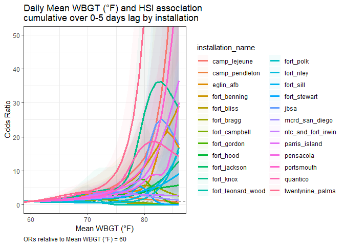

## Input data


```r
cc_exposure_df <-
  read_rds(file = "data/cc_exposure_df.rds") 

cc_exposure_df <-
  cc_exposure_df %>% 
    mutate("wbgt_mean" = weathermetrics::celsius.to.fahrenheit(wbgt_mean),
           "wbgt_max" = weathermetrics::celsius.to.fahrenheit(wbgt_max))

base_service_df <-
   read_rds(file = "data/base_service_df.rds") 

# Add installation branch of service and climate region

cc_exposure_df <-
  cc_exposure_df %>% 
    left_join(base_service_df %>%
                rename(base_service = service) %>% 
                dplyr::select(installation_name, base_service, region), by = "installation_name") 


daily_indices <- 
  read_rds(file = "data/daily_indices.rds") %>% 
    filter(!installation %in% c("fort_drum", "fort_huachuca", "fort_lewis",
                                "lackland_afb", "fort_carson", "west_point_mil_reservation")) %>% 
    mutate("wbgt_mean" = weathermetrics::celsius.to.fahrenheit(wbgt_mean),
           "wbgt_max" = weathermetrics::celsius.to.fahrenheit(wbgt_max),
            installation = recode(installation,
              "mcb_camp_lejeune" = "camp_lejeune",
              "mcb_camp_pendleton" = "camp_pendleton",
              "fort_benning_ga" = "fort_benning",
              "fort_sam_houston" = "jbsa",
              "mcrd_beaufort_parris_island" = "parris_island",
              "mcb_quantico" = "quantico",
              "twentynine_palms_main_base" = "twentynine_palms")) 
```


## Inputs


```r
selected_index <- "wbgt_mean"

# crossbasis options
set_lag <- 5    # total number days lag to assess
set_dr_df <- 5   # natural spline degrees of freedom for functional form of the dose-response curve
set_lag_df <- 4   # natural spline degrees of freedom for functional form of the lag

# crosspred options

set_increment <- 1   # crosspred "by = "
set_centered <- 60 # crosspred "cen= ", centered value for odds ratios 
set_min_temp <- 32   # crosspred lower bound


# crosspred upper-bound
set_max_temp <- case_when(
  selected_index %in% "wbgt_mean" ~ 90,
  selected_index %in% "wbgt_max" ~ 110,
  selected_index %in% "heat_index_mean" ~ 110,
  selected_index %in% "heat_index_max" ~ 120,
  selected_index %in% "tmp_f_mean" ~ 105,
  selected_index %in% "tmp_f_max" ~ 120,
    )

set_max_temp
```

```
## [1] 90
```

```r
# set max plot index value (approximate, or rounded-down from max value in dataset)
set_max_plot_value <- case_when(
  selected_index %in% "wbgt_mean" ~ 86,
  selected_index %in% "wbgt_max" ~ 104,
  selected_index %in% "heat_index_mean" ~ 104,
  selected_index %in% "heat_index_max" ~ 116,
  selected_index %in% "tmp_f_mean" ~ 98,
  selected_index %in% "tmp_f_max" ~ 112,
    )

set_max_plot_value
```

```
## [1] 86
```

```r
print_index <- case_when(
  selected_index %in% "wbgt_mean" ~ "Mean WBGT (°F)",
  selected_index %in% "wbgt_max" ~ "Max WBGT (°F)",
  selected_index %in% "heat_index_mean" ~ "Mean Heat Index (°F)",
  selected_index %in% "heat_index_max" ~ "Max Heat Index (°F)",
  selected_index %in% "tmp_f_mean" ~ "Mean Temperature (°F)",
  selected_index %in% "tmp_f_max" ~ "Max Temperature (°F)",
    )


print_index
```

```
## [1] "Mean WBGT (°F)"
```


## Lag function

```r
# DLNM
## Lags function

lags <- seq(set_lag) # Number of lags

lag_names <- paste("lag", formatC(lags, width = nchar(max(lags)), flag = "0"), 
  sep = "_")

lag_fun <- setNames(paste("dplyr::lag(., ", lags, ")"), lag_names)
```


## Create lag matrix for selected index; join to case-crossover dataframe


```r
 # create lag matrix

lag_matrix <-
  daily_indices %>% 
    filter(date %in% as.Date("1997-12-15"):as.Date("2019-12-31")) %>% 
      dplyr::select(installation, date, selected_index) %>% 
   group_by(installation) %>% 
   mutate_at(vars(selected_index), funs_(lag_fun)
  )
```

```
## Note: Using an external vector in selections is ambiguous.
## i Use `all_of(selected_index)` instead of `selected_index` to silence this message.
## i See <https://tidyselect.r-lib.org/reference/faq-external-vector.html>.
## This message is displayed once per session.
```

```r
# join lag matrix to case-crossover dataframe

cc_lag_matrix <-
  cc_exposure_df %>% 
    filter(year %in% 1998:2019) %>% 
    dplyr::select(!selected_index) %>%    # remove to avoid double listing after join
    left_join(lag_matrix,  by = c("installation_name" = "installation", "date" = "date")) 


cc_lag_only <- 
  cc_lag_matrix %>% 
  dplyr::select(selected_index, lag_1:paste0("lag_", set_lag))
```


## Define DLNM cross-basis


```r
# Define dlnm cross-basis (penalized splines)

index_cb <-
    crossbasis(
      cc_lag_only,    
      lag = set_lag,    # of lags
      argvar = list(fun = "ns", df = set_dr_df),    #  functional form of the dose-response curve
      arglag = list(fun = "ns", df = set_lag_df))    #  functional form of the lags

summary(index_cb)
```

```
## CROSSBASIS FUNCTIONS
## observations: 139875 
## range: 1.81 to 88.05 
## lag period: 0 5 
## total df:  20 
## 
## BASIS FOR VAR:
## fun: ns 
## knots: 63.42 70.49 76.25 79.53 
## intercept: FALSE 
## Boundary.knots: 1.81 88.05 
## 
## BASIS FOR LAG:
## fun: ns 
## knots: 1.666667 3.333333 
## intercept: TRUE 
## Boundary.knots: 0 5
```

```r
# run model and get prediction for selected_index


index_dlnm <- survival::clogit(case ~ 
                  index_cb +  # lagged, nonlinear term for exposure
                  strata(stratum), 
                  method = "efron",
                  data =  cc_exposure_df) 


pred_dlnm <- crosspred(index_cb, index_dlnm, by = set_increment, from = set_min_temp, to = set_max_temp, cen = set_centered, cumul = TRUE)


summary(pred_dlnm)
```

```
## PREDICTIONS:
## values: 59 
## centered at: 60 
## range: 32 , 90 
## lag: 0 5 
## exponentiated: yes 
## cumulative: yes 
## 
## MODEL:
## parameters: 20 
## class: clogit coxph 
## link: logit
```

## Odds ratio table 
(Relative to centered value)


```r
# pull designated values
pred_dlnm$allRRfit[c("74", "78", "80", "82", "84", "86")]
```

```
##        74        78        80        82        84        86 
##  2.472203  4.098449  5.940916  8.490687 11.931825 16.579337
```

```r
# full range
  # allRRfit: vector of exponentiated overall cumulative associations from allfit.


assign(paste0("or_table_", selected_index),
  bind_cols(names(pred_dlnm$allRRfit), pred_dlnm$allRRfit, pred_dlnm$allRRlow, pred_dlnm$allRRhigh) %>% 
    dplyr::rename(var = 1, rr = 2, ci_low = 3, ci_high = 4) %>% 
    mutate(index = selected_index) %>% 
    dplyr::filter(var %in% c(set_centered:set_max_plot_value))
  
)
```

```
## New names:
## * NA -> ...1
## * NA -> ...2
## * NA -> ...3
## * NA -> ...4
```

```r
eval(parse(text = paste0("or_table_", selected_index))) %>% 
  knitr::kable()
```


|var |        rr|    ci_low|   ci_high|index     |
|:---|---------:|---------:|---------:|:---------|
|60  |  1.000000|  1.000000|  1.000000|wbgt_mean |
|61  |  1.067737|  1.059500|  1.076038|wbgt_mean |
|62  |  1.142786|  1.124616|  1.161250|wbgt_mean |
|63  |  1.226083|  1.195951|  1.256974|wbgt_mean |
|64  |  1.318633|  1.274146|  1.364674|wbgt_mean |
|65  |  1.420397|  1.359301|  1.484238|wbgt_mean |
|66  |  1.530081|  1.450889|  1.613595|wbgt_mean |
|67  |  1.645765|  1.548060|  1.749637|wbgt_mean |
|68  |  1.764816|  1.649492|  1.888203|wbgt_mean |
|69  |  1.883815|  1.753141|  2.024228|wbgt_mean |
|70  |  1.998543|  1.855805|  2.152260|wbgt_mean |
|71  |  2.104486|  1.952668|  2.268107|wbgt_mean |
|72  |  2.206771|  2.044959|  2.381387|wbgt_mean |
|73  |  2.322305|  2.145019|  2.514243|wbgt_mean |
|74  |  2.472203|  2.272962|  2.688909|wbgt_mean |
|75  |  2.683519|  2.457548|  2.930267|wbgt_mean |
|76  |  2.993871|  2.737954|  3.273709|wbgt_mean |
|77  |  3.455224|  3.162358|  3.775212|wbgt_mean |
|78  |  4.098449|  3.746443|  4.483529|wbgt_mean |
|79  |  4.931223|  4.486834|  5.419626|wbgt_mean |
|80  |  5.940916|  5.382156|  6.557684|wbgt_mean |
|81  |  7.119756|  6.436441|  7.875614|wbgt_mean |
|82  |  8.490687|  7.645722|  9.429032|wbgt_mean |
|83  | 10.082986|  8.969124| 11.335176|wbgt_mean |
|84  | 11.931825| 10.352550| 13.752017|wbgt_mean |
|85  | 14.079869| 11.768965| 16.844534|wbgt_mean |
|86  | 16.579337| 13.224219| 20.785682|wbgt_mean |


## Plot model (ggplot)

```r
# As ggplot
  # https://www.rdocumentation.org/packages/season/versions/0.3.8/vignettes/season-vignette.Rmd link assisted with example "Plot of the temperature and death association averaging over all lags"

   # allRRfit: vector of exponentiated overall cumulative associations from allfit.
 
to_plot <- 
  data.frame(index = pred_dlnm$predvar, 
             mean = pred_dlnm$allRRfit,
             lower = pred_dlnm$allRRlow,
             upper = pred_dlnm$allRRhigh) %>% 
  filter(index <= set_max_plot_value)
  


assign(paste0("plot_", selected_index),
  ggplot(data = to_plot, aes(x = index, y = mean, ymin = lower, ymax = upper)) +
    geom_hline(lty = 2, yintercept = 1) + # horizontal reference line at no change in odds
    geom_ribbon(alpha = 0.2, fill = "cadetblue", color = "cadetblue") +
    geom_line(size = 1.25) +
    xlab(print_index) +
    ylab('Odds Ratio') +
    coord_cartesian(xlim = c(set_centered, set_max_plot_value)) +
    theme_bw() 
  )
    

# write_rds(plot_mean_wbgt, file = "output/plot_mean_wbgt.rds")


eval(parse(text = paste0("plot_", selected_index))) +
    ggtitle(paste0("Daily ", print_index, " and HSI association cumulative over 0-",
                   set_lag, " days lag")) +
    labs(caption = paste0("ORs relative to ",  print_index, " = ", set_centered)) +
    theme(plot.caption = element_text(hjust = 0))
```

<!-- -->


## Slice by lag day


```r
# Slice by lag
    # matRRfit: matrix of exponentiated specific associations from matfit
    # matfit: matrices of predictions and standard errors at the chosen combinations of predictor and lag values


to_plot_slice <- 
  pred_dlnm$matRRfit %>% 
    as.data.frame() %>% 
    rownames_to_column() %>% 
    rename(index_value = rowname) %>% 
    as_tibble() %>% 
    pivot_longer(-index_value, names_to = "lag", values_to = "OR") %>% 
  bind_cols(

    pred_dlnm$matRRlow %>% 
        as.data.frame() %>% 
        rownames_to_column() %>% 
        rename(index_value = rowname) %>% 
        as_tibble() %>% 
        pivot_longer(-index_value, names_to = "lag", values_to = "OR_low") %>% 
      dplyr::select(OR_low)
  ) %>% 
  bind_cols(
    
    pred_dlnm$matRRhigh %>% 
        as.data.frame() %>% 
        rownames_to_column() %>% 
        rename(index_value = rowname) %>% 
        as_tibble() %>% 
        pivot_longer(-index_value, names_to = "lag", values_to = "OR_high") %>% 
      dplyr::select(OR_high)
) %>% 
   filter(index_value <= set_max_plot_value) %>% 
  mutate(index_value = as.numeric(index_value))


  ggplot(data = to_plot_slice, aes(x = index_value, color = lag)) +
    geom_hline(lty = 2, yintercept = 1) + # horizontal reference line at no change in odds
    geom_point(aes(y = OR), size = 0.5) +
    geom_smooth(aes(y = OR), se = FALSE, size = 1.2, method = "loess") +
    geom_smooth(aes(y = OR_low), se = FALSE, size = 0.5, linetype = "dashed", method = "loess") +
    geom_smooth(aes(y = OR_high), se = FALSE, size = 0.5, linetype = "dashed", method = "loess") +
    xlab(print_index) +
    ylab('Odds Ratio') +
    coord_cartesian(xlim = c(set_centered, set_max_plot_value)) +
    theme_bw() 
```

```
## `geom_smooth()` using formula 'y ~ x'
## `geom_smooth()` using formula 'y ~ x'
## `geom_smooth()` using formula 'y ~ x'
```

<!-- -->

```r
# Cumulative by lag  
  
    # cumRRfit: matrix of exponentiated incremental cumulative associations from cumfit
    # cumfit: matrices of incremental cumulative predicted associations along lags and related standard errors at the chosen combinations of predictor and (integer) lag values
  
  
  to_plot_slice_cum <- 
  pred_dlnm$cumRRfit %>% 
    as.data.frame() %>% 
    rownames_to_column() %>% 
    rename(index_value = rowname) %>% 
    as_tibble() %>% 
    pivot_longer(-index_value, names_to = "lag", values_to = "OR") %>% 
  bind_cols(

    pred_dlnm$cumRRlow %>% 
        as.data.frame() %>% 
        rownames_to_column() %>% 
        rename(index_value = rowname) %>% 
        as_tibble() %>% 
        pivot_longer(-index_value, names_to = "lag", values_to = "OR_low") %>% 
      dplyr::select(OR_low)
  ) %>% 
  bind_cols(
    
    pred_dlnm$cumRRhigh %>% 
        as.data.frame() %>% 
        rownames_to_column() %>% 
        rename(index_value = rowname) %>% 
        as_tibble() %>% 
        pivot_longer(-index_value, names_to = "lag", values_to = "OR_high") %>% 
      dplyr::select(OR_high)
) %>% 
   filter(index_value <= set_max_plot_value) %>% 
  mutate(index_value = as.numeric(index_value))


  ggplot(data = to_plot_slice_cum, aes(x = index_value, color = lag)) +
    geom_hline(lty = 2, yintercept = 1) + # horizontal reference line at no change in odds
    geom_point(aes(y = OR), size = 0.5) +
    geom_smooth(aes(y = OR), se = FALSE, size = 1.2, method = "loess") +
    geom_smooth(aes(y = OR_low), se = FALSE, size = 0.5, linetype = "dashed", method = "loess") +
    geom_smooth(aes(y = OR_high), se = FALSE, size = 0.5, linetype = "dashed", method = "loess") +
    xlab(print_index) +
    ylab('Odds Ratio') +
    coord_cartesian(xlim = c(set_centered, set_max_plot_value)) +
    theme_bw() 
```

```
## `geom_smooth()` using formula 'y ~ x'
## `geom_smooth()` using formula 'y ~ x'
## `geom_smooth()` using formula 'y ~ x'
```

<!-- -->


## Nest by region
Nest `cc_exposure_df` by region


```r
# join lag matrix to case-crossover dataframe
# mutate new list-column for lag only matrix

assign(paste0(selected_index, "_nest_region"),
  cc_exposure_df %>%
    filter(year %in% 1998:2019) %>%
    dplyr::select(!selected_index) %>%    # remove to avoid double listing after join
    left_join(lag_matrix,  by = c("installation_name" = "installation", "date" = "date")) %>% 
    group_by(region) %>% 
    nest() %>% 
    rename(cc_lag_matrix = data) %>% 
    mutate(cc_lag_only =
             map(cc_lag_matrix, ~ .x %>% dplyr::select(selected_index, lag_1:paste0("lag_", set_lag))),
           index_cb = 
             map(cc_lag_only, ~ crossbasis(
                .x,    
                lag = set_lag,    # of lags
                argvar = list(fun = "ns", df = set_dr_df),    #  functional form of the dose-response curve
                arglag = list(fun = "ns", df = set_lag_df))                
              ),
           index_dlnm = 
             map2(.x = index_cb, .y = cc_lag_matrix,  ~ survival::clogit(case ~ 
                    .x +  # lagged, nonlinear term for exposure
                    strata(stratum), 
                    method = "efron",
                    data =  .y)),
            pred_dlnm = 
              map2(.x = index_cb, .y = index_dlnm, ~ crosspred(
                .x, .y, by = set_increment, from = set_min_temp, to = set_max_temp, cen = set_centered, cumul = TRUE)))
)  

eval(parse(text = paste0(selected_index, "_nest_region"))) 
```

```
## # A tibble: 4 x 6
## # Groups:   region [4]
##   region   cc_lag_matrix     cc_lag_only     index_cb       index_dlnm pred_dlnm
##   <chr>    <list>            <list>          <list>         <list>     <list>   
## 1 Southea~ <tibble [87,561 ~ <tibble [87,56~ <crossbss [87~ <clogit>   <crosspr~
## 2 Ohio Va~ <tibble [12,613 ~ <tibble [12,61~ <crossbss [12~ <clogit>   <crosspr~
## 3 South    <tibble [23,547 ~ <tibble [23,54~ <crossbss [23~ <clogit>   <crosspr~
## 4 West     <tibble [16,154 ~ <tibble [16,15~ <crossbss [16~ <clogit>   <crosspr~
```

```r
# Plot cumulative lag

to_plot_region <-
  eval(parse(text = paste0(selected_index, "_nest_region"))) %>% 
    mutate(to_plot = 
             map(.x = pred_dlnm, ~ 
                   data.frame(index = .x$predvar, 
                      mean = .x$allRRfit,
                      lower = .x$allRRlow,
                      upper = .x$allRRhigh))) %>% 
    dplyr::select(region, to_plot) %>% 
      unnest(to_plot) %>% 
  filter(index <= set_max_plot_value)


assign(paste0("plot_", selected_index, "_region"),
  ggplot(data = to_plot_region, aes(x = index, y = mean, ymin = lower, ymax = upper, color = region, fill = region)) +
    geom_hline(lty = 2, yintercept = 1) + # horizontal reference line at no change in odds
    geom_ribbon(alpha = 0.1, colour = NA) +
    geom_line(size = 1.25) +
    xlab(print_index) +
    ylab('Odds Ratio') +
    coord_cartesian(xlim = c(set_centered, set_max_plot_value), ylim = c(NA, NA)) +
    theme_bw() 
)

write_rds(paste0("plot_", selected_index, "_region"), 
  file = paste0("output/", paste0("plot_", selected_index, "_region"), ".rds"))


eval(parse(text = paste0("plot_", selected_index, "_region"))) +
    ggtitle(paste0("Daily", print_index, " and HSI association \ncumulative over 0-5 days lag by NOAA NCEI climate region")) +
    labs(caption = paste0("ORs relative to ",  print_index, " = ", set_centered)) +
    theme(plot.caption = element_text(hjust = 0)) 
```

<!-- -->


## Nest by installation primary* branch of service

Note: there is overlap at sites (eg JBSA incl Lackland AFB and Fort Sam Houston)
Nest `cc_exposure_df` by `base_service`


```r
assign(paste0(selected_index, "_nest_service"),
  cc_exposure_df %>%
    filter(year %in% 1998:2019) %>%
    dplyr::select(!selected_index) %>%    # remove to avoid double listing after join
    left_join(lag_matrix,  by = c("installation_name" = "installation", "date" = "date")) %>% 
    group_by(base_service) %>% 
    nest() %>% 
    rename(cc_lag_matrix = data) %>% 
    mutate(cc_lag_only =
             map(cc_lag_matrix, ~ .x %>% dplyr::select(selected_index, lag_1:paste0("lag_", set_lag))),
           index_cb = 
             map(cc_lag_only, ~ crossbasis(
                .x,    
                lag = set_lag,    # of lags
                argvar = list(fun = "ns", df = set_dr_df),    #  functional form of the dose-response curve
                arglag = list(fun = "ns", df = set_lag_df))                
              ),
           index_dlnm = 
             map2(.x = index_cb, .y = cc_lag_matrix,  ~ survival::clogit(case ~ 
                    .x +  # lagged, nonlinear term for exposure
                    strata(stratum), 
                    method = "efron",
                    data =  .y)),
            pred_dlnm = 
              map2(.x = index_cb, .y = index_dlnm, ~ crosspred(
                .x, .y, by = set_increment, from = set_min_temp, to = set_max_temp, cen = set_centered, cumul = TRUE)))
)  

eval(parse(text = paste0(selected_index, "_nest_service"))) 
```

```
## # A tibble: 4 x 6
## # Groups:   base_service [4]
##   base_service cc_lag_matrix    cc_lag_only    index_cb     index_dlnm pred_dlnm
##   <chr>        <list>           <list>         <list>       <list>     <list>   
## 1 Army         <tibble [88,629~ <tibble [88,6~ <crossbss [~ <clogit>   <crosspr~
## 2 Marine Corps <tibble [42,871~ <tibble [42,8~ <crossbss [~ <clogit>   <crosspr~
## 3 Air Force    <tibble [5,449 ~ <tibble [5,44~ <crossbss [~ <clogit>   <crosspr~
## 4 Navy         <tibble [2,926 ~ <tibble [2,92~ <crossbss [~ <clogit>   <crosspr~
```

```r
# Plot cumulative lag

to_plot_service <-
  eval(parse(text = paste0(selected_index, "_nest_service"))) %>% 
    mutate(to_plot = 
             map(.x = pred_dlnm, ~ 
                   data.frame(index = .x$predvar, 
                      mean = .x$allRRfit,
                      lower = .x$allRRlow,
                      upper = .x$allRRhigh))) %>% 
    dplyr::select(base_service, to_plot) %>% 
      unnest(to_plot) %>% 
  filter(index <= set_max_plot_value)


assign(paste0("plot_", selected_index, "_service"),
  ggplot(data = to_plot_service, aes(x = index, y = mean, ymin = lower, ymax = upper, color = base_service, fill = base_service)) +
    geom_hline(lty = 2, yintercept = 1) + # horizontal reference line at no change in odds
    geom_ribbon(alpha = 0.1, colour = NA) +
    geom_line(size = 1.25) +
    xlab(print_index) +
    ylab('Odds Ratio') +
    coord_cartesian(xlim = c(set_centered, set_max_plot_value), ylim = c(NA, NA)) +
    theme_bw() 
)

write_rds(paste0("plot_", selected_index, "_service"), 
  file = paste0("output/", paste0("plot_", selected_index, "_service"), ".rds"))


eval(parse(text = paste0("plot_", selected_index, "_service"))) +
    ggtitle(paste0("Daily ", print_index, " and HSI association \ncumulative over 0-5 days lag by service branch (installation-level)")) +
    labs(caption = paste0("ORs relative to ",  print_index, " = ", set_centered)) +
    theme(plot.caption = element_text(hjust = 0)) 
```

<!-- -->


## Nest by time in season

1st look: pre vs post 4th of July 
days 0-185 (early season) vs days 186-366 (late season) 


```r
assign(paste0(selected_index, "_nest_tis"),
  cc_exposure_df %>%
    filter(year %in% 1998:2019) %>%
    dplyr::select(!selected_index) %>%    # remove to avoid double listing after join
    left_join(lag_matrix,  by = c("installation_name" = "installation", "date" = "date")) %>% 
    mutate(`Day of Year` = lubridate::yday(date),
           `Time in season` = case_when(
                 `Day of Year` <= 185 ~ "Early season",
                   `Day of Year` > 185 ~ "Late season"
              )) %>% 
    group_by(`Time in season`) %>% 
    nest() %>% 
    rename(cc_lag_matrix = data) %>% 
    mutate(cc_lag_only =
             map(cc_lag_matrix, ~ .x %>% dplyr::select(selected_index, lag_1:paste0("lag_", set_lag))),
           index_cb = 
             map(cc_lag_only, ~ crossbasis(
                .x,    
                lag = set_lag,    # of lags
                argvar = list(fun = "ns", df = set_dr_df),    #  functional form of the dose-response curve
                arglag = list(fun = "ns", df = set_lag_df))                
              ),
           index_dlnm = 
             map2(.x = index_cb, .y = cc_lag_matrix,  ~ survival::clogit(case ~ 
                    .x +  # lagged, nonlinear term for exposure
                    strata(stratum), 
                    method = "efron",
                    data =  .y)),
            pred_dlnm = 
              map2(.x = index_cb, .y = index_dlnm, ~ crosspred(
                .x, .y, by = set_increment, from = set_min_temp, to = set_max_temp, cen = set_centered, cumul = TRUE)))
)  

eval(parse(text = paste0(selected_index, "_nest_tis"))) 
```

```
## # A tibble: 2 x 6
## # Groups:   Time in season [2]
##   `Time in season` cc_lag_matrix   cc_lag_only   index_cb   index_dlnm pred_dlnm
##   <chr>            <list>          <list>        <list>     <list>     <list>   
## 1 Late season      <tibble [83,63~ <tibble [83,~ <crossbss~ <clogit>   <crosspr~
## 2 Early season     <tibble [56,24~ <tibble [56,~ <crossbss~ <clogit>   <crosspr~
```

```r
# Plot cumulative lag

to_plot_tis <-
  eval(parse(text = paste0(selected_index, "_nest_tis"))) %>% 
    mutate(to_plot = 
             map(.x = pred_dlnm, ~ 
                   data.frame(index = .x$predvar, 
                      mean = .x$allRRfit,
                      lower = .x$allRRlow,
                      upper = .x$allRRhigh))) %>% 
    dplyr::select(`Time in season`, to_plot) %>% 
      unnest(to_plot) %>% 
  filter(index <= set_max_plot_value)


assign(paste0("plot_", selected_index, "_tis"),
  ggplot(data = to_plot_tis, aes(x = index, y = mean, ymin = lower, ymax = upper, color = `Time in season`, fill = `Time in season`)) +
    geom_hline(lty = 2, yintercept = 1) + # horizontal reference line at no change in odds
    geom_ribbon(alpha = 0.1, colour = NA) +
    geom_line(size = 1.25) +
    xlab(print_index) +
    ylab('Odds Ratio') +
    coord_cartesian(xlim = c(set_centered, set_max_plot_value), ylim = c(NA, NA)) +
    theme_bw() 
)

write_rds(paste0("plot_", selected_index, "_tis"), 
  file = paste0("output/", paste0("plot_", selected_index, "_tis"), ".rds"))


eval(parse(text = paste0("plot_", selected_index, "_tis"))) +
    ggtitle(paste0("Daily ", print_index, " and HSI association \ncumulative over 0-5 days lag by time in season")) +
    labs(caption = paste0("ORs relative to ",  print_index, " = ", set_centered)) +
    theme(plot.caption = element_text(hjust = 0)) 
```

<!-- -->


## Nest by installation


```r
assign(paste0(selected_index, "_nest_base"),
  cc_exposure_df %>%
    filter(year %in% 1998:2019) %>%
    dplyr::select(!selected_index) %>%    # remove to avoid double listing after join
    left_join(lag_matrix,  by = c("installation_name" = "installation", "date" = "date")) %>% 
    group_by(installation_name) %>% 
    nest() %>% 
    rename(cc_lag_matrix = data) %>% 
    mutate(cc_lag_only =
             map(cc_lag_matrix, ~ .x %>% dplyr::select(selected_index, lag_1:paste0("lag_", set_lag))),
           index_cb = 
             map(cc_lag_only, ~ crossbasis(
                .x,    
                lag = set_lag,    # of lags
                argvar = list(fun = "ns", df = set_dr_df),    #  functional form of the dose-response curve
                arglag = list(fun = "ns", df = set_lag_df))                
              ),
           index_dlnm = 
             map2(.x = index_cb, .y = cc_lag_matrix,  ~ survival::clogit(case ~ 
                    .x +  # lagged, nonlinear term for exposure
                    strata(stratum), 
                    method = "efron",
                    data =  .y)),
            pred_dlnm = 
              map2(.x = index_cb, .y = index_dlnm, ~ crosspred(
                .x, .y, by = set_increment, from = set_min_temp, to = set_max_temp, cen = set_centered, cumul = TRUE)))
)  

eval(parse(text = paste0(selected_index, "_nest_base"))) 
```

```
## # A tibble: 24 x 6
## # Groups:   installation_name [24]
##    installation_name cc_lag_matrix  cc_lag_only  index_cb   index_dlnm pred_dlnm
##    <chr>             <list>         <list>       <list>     <list>     <list>   
##  1 fort_benning      <tibble [20,7~ <tibble [20~ <crossbss~ <clogit>   <crosspr~
##  2 fort_bragg        <tibble [20,9~ <tibble [20~ <crossbss~ <clogit>   <crosspr~
##  3 camp_lejeune      <tibble [13,1~ <tibble [13~ <crossbss~ <clogit>   <crosspr~
##  4 parris_island     <tibble [10,8~ <tibble [10~ <crossbss~ <clogit>   <crosspr~
##  5 fort_campbell     <tibble [8,77~ <tibble [8,~ <crossbss~ <clogit>   <crosspr~
##  6 fort_polk         <tibble [7,46~ <tibble [7,~ <crossbss~ <clogit>   <crosspr~
##  7 fort_jackson      <tibble [7,78~ <tibble [7,~ <crossbss~ <clogit>   <crosspr~
##  8 camp_pendleton    <tibble [6,59~ <tibble [6,~ <crossbss~ <clogit>   <crosspr~
##  9 fort_hood         <tibble [5,83~ <tibble [5,~ <crossbss~ <clogit>   <crosspr~
## 10 mcrd_san_diego    <tibble [5,12~ <tibble [5,~ <crossbss~ <clogit>   <crosspr~
## # ... with 14 more rows
```

```r
# Plot cumulative lag

to_plot_base <-
  eval(parse(text = paste0(selected_index, "_nest_base"))) %>% 
    mutate(to_plot = 
             map(.x = pred_dlnm, ~ 
                   data.frame(index = .x$predvar, 
                      mean = .x$allRRfit,
                      lower = .x$allRRlow,
                      upper = .x$allRRhigh))) %>% 
    dplyr::select(installation_name, to_plot) %>% 
      unnest(to_plot) %>% 
  filter(index <= set_max_plot_value)


assign(paste0("plot_", selected_index, "_base"),
  ggplot(data = to_plot_base, aes(x = index, y = mean, ymin = lower, ymax = upper, color = installation_name, fill = installation_name)) +
    geom_hline(lty = 2, yintercept = 1) + # horizontal reference line at no change in odds
    geom_ribbon(alpha = 0.05, colour = NA) +
    geom_line(size = 1.25) +
    xlab(print_index) +
    ylab('Odds Ratio') +
    coord_cartesian(xlim = c(set_centered, set_max_plot_value), ylim = c(NA, 50)) +
    theme_bw() 
)

write_rds(paste0("plot_", selected_index, "_base"), 
  file = paste0("output/", paste0("plot_", selected_index, "_base"), ".rds"))


eval(parse(text = paste0("plot_", selected_index, "_base"))) +
    ggtitle(paste0("Daily ", print_index, " and HSI association \ncumulative over 0-5 days lag by installation")) +
    labs(caption = paste0("ORs relative to ",  print_index, " = ", set_centered)) +
    theme(plot.caption = element_text(hjust = 0)) 
```

<!-- -->

