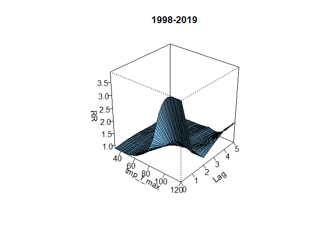
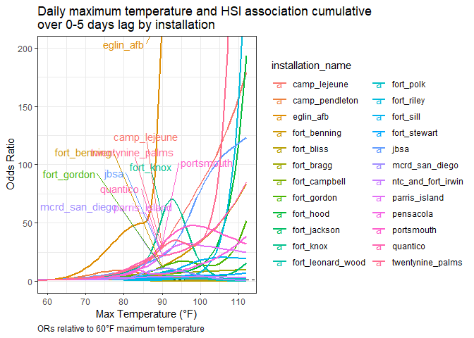

```r
cc_exposure_df <-
  read_rds(file = "data/cc_exposure_df.rds") 

cc_exposure_df <-
  cc_exposure_df %>% 
    mutate("wbgt_mean" = weathermetrics::celsius.to.fahrenheit(wbgt_mean),
           "wbgt_max" = weathermetrics::celsius.to.fahrenheit(wbgt_max))

base_service_df <-
   read_rds(file = "data/base_service_df.rds") 

# Add installation branch of service and climate region

cc_exposure_df <-
  cc_exposure_df %>% 
    left_join(base_service_df %>%
                rename(base_service = service) %>% 
                dplyr::select(installation_name, base_service, region), by = "installation_name") 


daily_indices <- 
  read_rds(file = "data/daily_indices.rds") %>% 
    filter(!installation %in% c("fort_drum", "fort_huachuca", "fort_lewis",
                                "lackland_afb", "fort_carson", "west_point_mil_reservation")) %>% 
    mutate("wbgt_mean" = weathermetrics::celsius.to.fahrenheit(wbgt_mean),
           "wbgt_max" = weathermetrics::celsius.to.fahrenheit(wbgt_max),
            installation = recode(installation,
              "mcb_camp_lejeune" = "camp_lejeune",
              "mcb_camp_pendleton" = "camp_pendleton",
              "fort_benning_ga" = "fort_benning",
              "fort_sam_houston" = "jbsa",
              "mcrd_beaufort_parris_island" = "parris_island",
              "mcb_quantico" = "quantico",
              "twentynine_palms_main_base" = "twentynine_palms")) 
     


daily_indices %>% 
  count(installation)
```

```
## # A tibble: 24 x 2
## # Groups:   installation [24]
##    installation       n
##    <chr>          <int>
##  1 camp_lejeune   10958
##  2 camp_pendleton 10958
##  3 eglin_afb      10958
##  4 fort_benning   10958
##  5 fort_bliss     10958
##  6 fort_bragg     10958
##  7 fort_campbell  10958
##  8 fort_gordon    10958
##  9 fort_hood      10958
## 10 fort_jackson   10958
## # ... with 14 more rows
```

```r
cc_exposure_df %>% 
  count(installation_name) 
```

```
## # A tibble: 24 x 2
##    installation_name     n
##    <fct>             <int>
##  1 fort_benning      20795
##  2 fort_bragg        20964
##  3 camp_lejeune      13197
##  4 parris_island     10876
##  5 fort_campbell      8773
##  6 fort_polk          7466
##  7 fort_jackson       7782
##  8 camp_pendleton     6595
##  9 fort_hood          5830
## 10 mcrd_san_diego     5127
## # ... with 14 more rows
```


```r
# DLNM
## Lags function

lags <- seq(5) # Number of lags

lag_names <- paste("lag", formatC(lags, width = nchar(max(lags)), flag = "0"), 
  sep = "_")

lag_fun <- setNames(paste("dplyr::lag(., ", lags, ")"), lag_names)
```


```r
selected_index <- "tmp_f_max"


  # create lag matrix

lag_matrix <-
  daily_indices %>% 
    filter(date %in% as.Date("1997-12-15"):as.Date("2019-12-31")) %>% 
      dplyr::select(installation, date, selected_index) %>% 
   group_by(installation) %>% 
   mutate_at(vars(selected_index), funs_(lag_fun)
  )
```

```
## Note: Using an external vector in selections is ambiguous.
## i Use `all_of(selected_index)` instead of `selected_index` to silence this message.
## i See <https://tidyselect.r-lib.org/reference/faq-external-vector.html>.
## This message is displayed once per session.
```

```r
# join lag matrix to case-crossover dataframe

cc_lag_matrix <-
  cc_exposure_df %>% 
    filter(year %in% 1998:2019) %>% 
    dplyr::select(!selected_index) %>%    # remove to avoid double listing after join
    left_join(lag_matrix,  by = c("installation_name" = "installation", "date" = "date")) 


cc_lag_only <- 
  cc_lag_matrix %>% 
  dplyr::select(selected_index, lag_1:lag_5)


# Define dlnm cross-basis (penalized splines)

index_cb <-
    crossbasis(
      cc_lag_only,    
      lag = 5,    # of lags
      argvar = list(fun = "ns", df = 5),    #  functional form of the dose-response curve
      arglag = list(fun = "ns", df = 4))    #  functional form of the lags

summary(index_cb)
```

```
## CROSSBASIS FUNCTIONS
## observations: 139875 
## range: 6.78 to 113.32 
## lag period: 0 5 
## total df:  20 
## 
## BASIS FOR VAR:
## fun: ns 
## knots: 75.69 84.24 88.54 93.34 
## intercept: FALSE 
## Boundary.knots: 6.78 113.32 
## 
## BASIS FOR LAG:
## fun: ns 
## knots: 1.666667 3.333333 
## intercept: TRUE 
## Boundary.knots: 0 5
```

```r
# run model and get prediction for selected_index


index_dlnm <- survival::clogit(case ~ 
                  index_cb +  # lagged, nonlinear term for exposure
                  strata(stratum), 
                  method = "efron",
                  data =  cc_exposure_df) 


pred_dlnm <- crosspred(index_cb, index_dlnm, by = 1, from = 0, to = 115, cen = 60, cumul = TRUE)
  # when run with centering value unspecified: Automatically set to 60 

summary(pred_dlnm)
```

```
## PREDICTIONS:
## values: 116 
## centered at: 60 
## range: 0 , 115 
## lag: 0 5 
## exponentiated: yes 
## cumulative: yes 
## 
## MODEL:
## parameters: 20 
## class: clogit coxph 
## link: logit
```

```r
## Overall effect RRs

pred_dlnm$allRRfit[c("70", "80", "90", "100", "110")]
```

```
##        70        80        90       100       110 
##  1.595304  3.213195  7.019065 11.210134 19.434043
```

```r
bind_cols(names(pred_dlnm$allRRfit), pred_dlnm$allRRfit, pred_dlnm$allRRlow, pred_dlnm$allRRhigh) %>% 
  dplyr::rename(var = 1, rr = 2, ci_low = 3, ci_high = 4) %>% 
  dplyr::filter(var %in% c("70", "80", "90", "100", "110")) %>% 
  knitr::kable()
```

```
## New names:
## * NA -> ...1
## * NA -> ...2
## * NA -> ...3
## * NA -> ...4
```


|var |        rr|    ci_low|   ci_high|
|:---|---------:|---------:|---------:|
|70  |  1.595304|  1.516115|  1.678629|
|80  |  3.213195|  2.848976|  3.623976|
|90  |  7.019065|  6.184865|  7.965779|
|100 | 11.210134|  9.694883| 12.962209|
|110 | 19.434043| 15.525752| 24.326167|


## Plot model (ggplot)

```r
# As ggplot
  # https://www.rdocumentation.org/packages/season/versions/0.3.8/vignettes/season-vignette.Rmd link assisted with example "Plot of the temperature and death association averaging over all lags"

 
to_plot <- 
  data.frame(index = pred_dlnm$predvar, 
             mean = pred_dlnm$allRRfit,
             lower = pred_dlnm$allRRlow,
             upper = pred_dlnm$allRRhigh)


ggplot(data = to_plot, aes(x = index, y = mean, ymin = lower, ymax = upper)) +
  geom_hline(lty = 2, yintercept = 1) + # horizontal reference line at no change in odds
  geom_ribbon(alpha = 0.2, fill = "cadetblue", color = "cadetblue") +
  geom_line(size = 1.25) +
  xlab('Max Temperature (°F)') +
  ylab('Odds Ratio') +
  xlim(60, NA) +
  theme_bw() +
  ggtitle("Daily maximum temperature and HSI association \ncumulative over 0-5 days lag") +
  labs(caption = "ORs relative to 60°F max temperature") +
  theme(plot.caption = element_text(hjust = 0)) 
```

```
## Warning: Removed 60 row(s) containing missing values (geom_path).
```

<!-- -->

```r
# "Base R" plots by lag "slices"  

plot(pred_dlnm, "slices",
     lag = 0,
     ylim = c(0, 25),
     xlim = c(60, 115),
     lwd = 4,
     col = "red",
     main = "Exposure-Response Effects by Lag Day  \n  1998-2019", 
     xlab = "Maximum Temperature (°F)", 
     ylab = "HSI Rate Ratio")


lines(pred_dlnm, "slices",
     lag = 1,
     lwd = 4,
     col = "blue"
)

lines(pred_dlnm, "slices",
     lag = 2,
     lwd = 4,
     col = "green"
)


lines(pred_dlnm, "slices",
     lag = 3,
     lwd = 4,
     col = "orange")

legend("topleft", legend = c("Lag 0", "Lag 1", "Lag 2", "Lag 3"),
       col = c("red", "blue", "green", "orange"), lty = 1, cex = 1)
```

<!-- -->

```r
#3D Plot prep

plot(pred_dlnm, 
     xlab = paste(selected_index), zlab = "\nRR", ylab = "\nLag", 
     theta = 40, phi = 30, lphi = 30,
     main = "1998-2019")
```

<!-- -->

```r
# https://rdrr.io/cran/dlnm/src/R/seqlag.R
seqlag <- function(lag,by = 1) seq(from = lag[1],to = lag[2],by = by)


to_plot <- 
  data.frame(index = pred_dlnm$predvar, 
             mean = pred_dlnm$allRRfit,
             lower = pred_dlnm$allRRlow,
             upper = pred_dlnm$allRRhigh)


to_3d <- list(x = matrix(pred_dlnm$predvar), 
              y = matrix(seqlag(pred_dlnm$lag, pred_dlnm$bylag)), 
              z = matrix(unlist(pred_dlnm$matfit), ncol = 6, byrow = TRUE))


x <- as_vector(pred_dlnm$predvar)
y <- as.vector(seqlag(pred_dlnm$lag, pred_dlnm$bylag))
z <- pred_dlnm$matRRfit

df_3d <-  
  z %>% 
    melt() %>% 
    as_tibble() %>% 
    rename(
      "Max Temperature" = Var1,
      "Lag" = Var2,
      "OR" = value
    ) %>% 
    mutate(Lag = as.numeric(str_remove(Lag, "lag"))) 

df_3d$OR %>% summary()
```

```
##    Min. 1st Qu.  Median    Mean 3rd Qu.    Max. 
##  0.8750  0.9606  1.0219  1.1809  1.1506  3.8807
```

```r
# 3d plot with rayshader

gg_3d <-
  df_3d %>% 
  filter(`Max Temperature` >= 50) %>% 
  ggplot() +
    geom_raster(aes(x = `Max Temperature`, y = `Lag`, fill = `OR`)) +
    scale_fill_viridis()


plot_gg(gg_3d, multicore = TRUE, width = 5, height = 5, scale = 250)

# Render 3D movie

# filename_movie <- "output/mean_temp_3d.mp4"
# 
# render_movie(filename = filename_movie, type = "orbit", 
#              frames = 360,  phi = 30, zoom = 0.8, theta = -90,
#              title_text = "Mean Temperature Odds Ratio")


# 3D print file
#filename_stl = "output/mean_temp_3d.stl"
#save_3dprint(filename_stl, rotate = TRUE)
```


## Examine by region
Nest `cc_exposure_df` by region


```r
# create lag matrix

lag_matrix <-
  daily_indices %>% 
    filter(date %in% as.Date("1997-12-15"):as.Date("2019-12-31")) %>% 
      dplyr::select(installation, date, selected_index) %>% 
   group_by(installation) %>% 
   mutate_at(vars(selected_index), funs_(lag_fun)
  )


# join lag matrix to case-crossover dataframe
# mutate new list-column for lag only matrix

temp_max_nest_region <-
  cc_exposure_df %>%
    filter(year %in% 1998:2019) %>%
    dplyr::select(!selected_index) %>%    # remove to avoid double listing after join
    left_join(lag_matrix,  by = c("installation_name" = "installation", "date" = "date")) %>% 
    group_by(region) %>% 
    nest() %>% 
    rename(cc_lag_matrix = data) %>% 
    mutate(cc_lag_only =
             map(cc_lag_matrix, ~ .x %>% dplyr::select(selected_index, lag_1:lag_5)),
           index_cb = 
             map(cc_lag_only, ~ crossbasis(
                .x,    
                lag = 5,    # of lags
                argvar = list(fun = "ns", df = 5),    #  functional form of the dose-response curve
                arglag = list(fun = "ns", df = 4))                
              ),
           index_dlnm = 
             map2(.x = index_cb, .y = cc_lag_matrix,  ~ survival::clogit(case ~ 
                    .x +  # lagged, nonlinear term for exposure
                    strata(stratum), 
                    method = "efron",
                    data =  .y)),
            pred_dlnm = 
              map2(.x = index_cb, .y = index_dlnm, ~ crosspred(
                .x, .y, by = 1, from = 0, to = 115, cen = 60, cumul = TRUE)))
            

temp_max_nest_region
```

```
## # A tibble: 4 x 6
## # Groups:   region [4]
##   region   cc_lag_matrix     cc_lag_only     index_cb       index_dlnm pred_dlnm
##   <chr>    <list>            <list>          <list>         <list>     <list>   
## 1 Southea~ <tibble [87,561 ~ <tibble [87,56~ <crossbss [87~ <clogit>   <crosspr~
## 2 Ohio Va~ <tibble [12,613 ~ <tibble [12,61~ <crossbss [12~ <clogit>   <crosspr~
## 3 South    <tibble [23,547 ~ <tibble [23,54~ <crossbss [23~ <clogit>   <crosspr~
## 4 West     <tibble [16,154 ~ <tibble [16,15~ <crossbss [16~ <clogit>   <crosspr~
```

```r
# Plot cumulative lag

to_plot_region <-
  temp_max_nest_region %>% 
    mutate(to_plot = 
             map(.x = pred_dlnm, ~ 
                   data.frame(index = .x$predvar, 
                      mean = .x$allRRfit,
                      lower = .x$allRRlow,
                      upper = .x$allRRhigh))) %>% 
    dplyr::select(region, to_plot) %>% 
      unnest(to_plot)


ggplot(data = to_plot_region, aes(x = index, y = mean, ymin = lower, ymax = upper, color = region, fill = region)) +
  geom_hline(lty = 2, yintercept = 1) + # horizontal reference line at no change in odds
  geom_ribbon(alpha = 0.1, colour = NA) +
  geom_line(size = 1.25) +
  xlab('Max Temperature (°F)') +
  ylab('Odds Ratio') +
  xlim(60, NA) +
  theme_bw() +
  ggtitle("Daily maximum Temperature and HSI association cumulative\nover 0-5 days lag by NOAA NCEI climate region") +
  labs(caption = "ORs relative to 60°F maximum temperature") +
  theme(plot.caption = element_text(hjust = 0)) 
```

<!-- -->

```r
## Overall effect RRs

pred_dlnm$allRRfit[c("70", "80", "90", "100", "110")]
```

```
##        70        80        90       100       110 
##  1.595304  3.213195  7.019065 11.210134 19.434043
```

```r
bind_cols(names(pred_dlnm$allRRfit), pred_dlnm$allRRfit, pred_dlnm$allRRlow, pred_dlnm$allRRhigh) %>% 
  dplyr::rename(var = 1, rr = 2, ci_low = 3, ci_high = 4) %>% 
  dplyr::filter(var %in% c("70", "80", "90", "100", "110"))
```

```
## New names:
## * NA -> ...1
## * NA -> ...2
## * NA -> ...3
## * NA -> ...4
```

```
## # A tibble: 5 x 4
##   var      rr ci_low ci_high
##   <chr> <dbl>  <dbl>   <dbl>
## 1 70     1.60   1.52    1.68
## 2 80     3.21   2.85    3.62
## 3 90     7.02   6.18    7.97
## 4 100   11.2    9.69   13.0 
## 5 110   19.4   15.5    24.3
```


## Examine by installation primary* branch of service

Note: there is overlap at sites (eg JBSA incl Lackland AFB and Fort Sam Houston)
Nest `cc_exposure_df` by `base_service`


```r
# create lag matrix

lag_matrix <-
  daily_indices %>% 
    filter(date %in% as.Date("1997-12-15"):as.Date("2019-12-31")) %>% 
      dplyr::select(installation, date, selected_index) %>% 
   group_by(installation) %>% 
   mutate_at(vars(selected_index), funs_(lag_fun)
  )


# join lag matrix to case-crossover dataframe
# mutate new list-column for lag only matrix

temp_max_nest_service <-
  cc_exposure_df %>%
    filter(year %in% 1998:2019) %>%
    dplyr::select(!selected_index) %>%    # remove to avoid double listing after join
    left_join(lag_matrix,  by = c("installation_name" = "installation", "date" = "date")) %>% 
    group_by(base_service) %>% 
    nest() %>% 
    rename(cc_lag_matrix = data) %>% 
    mutate(cc_lag_only =
             map(cc_lag_matrix, ~ .x %>% dplyr::select(selected_index, lag_1:lag_5)),
           index_cb = 
             map(cc_lag_only, ~ crossbasis(
                .x,    
                lag = 5,    # of lags
                argvar = list(fun = "ns", df = 5),    #  functional form of the dose-response curve
                arglag = list(fun = "ns", df = 4))                
              ),
           index_dlnm = 
             map2(.x = index_cb, .y = cc_lag_matrix,  ~ survival::clogit(case ~ 
                    .x +  # lagged, nonlinear term for exposure
                    strata(stratum), 
                    method = "efron",
                    data =  .y)),
            pred_dlnm = 
              map2(.x = index_cb, .y = index_dlnm, ~ crosspred(
                .x, .y, by = 1, from = 0, to = 115, cen = 60, cumul = TRUE)))
            

temp_max_nest_service
```

```
## # A tibble: 4 x 6
## # Groups:   base_service [4]
##   base_service cc_lag_matrix    cc_lag_only    index_cb     index_dlnm pred_dlnm
##   <chr>        <list>           <list>         <list>       <list>     <list>   
## 1 Army         <tibble [88,629~ <tibble [88,6~ <crossbss [~ <clogit>   <crosspr~
## 2 Marine Corps <tibble [42,871~ <tibble [42,8~ <crossbss [~ <clogit>   <crosspr~
## 3 Air Force    <tibble [5,449 ~ <tibble [5,44~ <crossbss [~ <clogit>   <crosspr~
## 4 Navy         <tibble [2,926 ~ <tibble [2,92~ <crossbss [~ <clogit>   <crosspr~
```

```r
# Plot cumulative lag

to_plot_region <-
  temp_max_nest_service %>% 
    mutate(to_plot = 
             map(.x = pred_dlnm, ~ 
                   data.frame(index = .x$predvar, 
                      mean = .x$allRRfit,
                      lower = .x$allRRlow,
                      upper = .x$allRRhigh))) %>% 
    dplyr::select(base_service, to_plot) %>% 
      unnest(to_plot)


ggplot(data = to_plot_region, aes(x = index, y = mean, ymin = lower, ymax = upper, color = base_service, fill = base_service)) +
  geom_hline(lty = 2, yintercept = 1) + # horizontal reference line at no change in odds
  geom_ribbon(alpha = 0.1, colour = NA) +
  geom_line(size = 1.25) +
  xlab('Max Temperature (°F)') +
  ylab('Odds Ratio') +
  xlim(60, NA) +
  ylim(NA, 200) +
  theme_bw() +
  ggtitle("Daily maximum temperature and HSI association cumulative\nover 0-5 days lag by installation primary service branch") +
  labs(caption = "ORs relative to 60°F maximum temperature") +
  theme(plot.caption = element_text(hjust = 0)) 
```

<!-- -->

```r
## Overall effect RRs

pred_dlnm$allRRfit[c("70", "80", "90", "100", "110")]
```

```
##        70        80        90       100       110 
##  1.595304  3.213195  7.019065 11.210134 19.434043
```

```r
bind_cols(names(pred_dlnm$allRRfit), pred_dlnm$allRRfit, pred_dlnm$allRRlow, pred_dlnm$allRRhigh) %>% 
  dplyr::rename(var = 1, rr = 2, ci_low = 3, ci_high = 4) %>% 
  dplyr::filter(var %in% c("70", "80", "90", "100", "110"))
```

```
## New names:
## * NA -> ...1
## * NA -> ...2
## * NA -> ...3
## * NA -> ...4
```

```
## # A tibble: 5 x 4
##   var      rr ci_low ci_high
##   <chr> <dbl>  <dbl>   <dbl>
## 1 70     1.60   1.52    1.68
## 2 80     3.21   2.85    3.62
## 3 90     7.02   6.18    7.97
## 4 100   11.2    9.69   13.0 
## 5 110   19.4   15.5    24.3
```


## Examine by time in season

1st look: pre vs post 4th of July 
days 0-185 (early season) vs days 186-366 (late season) 

  mutate(`Day of Year` = lubridate::yday(date))

```r
# join lag matrix to case-crossover dataframe
# mutate new list-column for lag only matrix

temp_max_nest_tis <-
  cc_exposure_df %>%
    filter(year %in% 1998:2019) %>%
    dplyr::select(!selected_index) %>%    # remove to avoid double listing after join
    left_join(lag_matrix,  by = c("installation_name" = "installation", "date" = "date")) %>%
    mutate(`Day of Year` = lubridate::yday(date),
           `Time in season` = case_when(
                 `Day of Year` <= 185 ~ "Early season",
                   `Day of Year` > 185 ~ "Late season"
              )) %>% 
    group_by(`Time in season`) %>% 
    nest() %>% 
    rename(cc_lag_matrix = data) %>% 
    mutate(cc_lag_only =
             map(cc_lag_matrix, ~ .x %>% dplyr::select(selected_index, lag_1:lag_5)),
           index_cb = 
             map(cc_lag_only, ~ crossbasis(
                .x,    
                lag = 5,    # of lags
                argvar = list(fun = "ns", df = 5),    #  functional form of the dose-response curve
                arglag = list(fun = "ns", df = 4))                
              ),
           index_dlnm = 
             map2(.x = index_cb, .y = cc_lag_matrix,  ~ survival::clogit(case ~ 
                    .x +  # lagged, nonlinear term for exposure
                    strata(stratum), 
                    method = "efron",
                    data =  .y)),
            pred_dlnm = 
              map2(.x = index_cb, .y = index_dlnm, ~ crosspred(
                .x, .y, by = 1, from = 0, to = 115, cen = 60, cumul = TRUE)))
            

temp_max_nest_tis
```

```
## # A tibble: 2 x 6
## # Groups:   Time in season [2]
##   `Time in season` cc_lag_matrix   cc_lag_only   index_cb   index_dlnm pred_dlnm
##   <chr>            <list>          <list>        <list>     <list>     <list>   
## 1 Late season      <tibble [83,63~ <tibble [83,~ <crossbss~ <clogit>   <crosspr~
## 2 Early season     <tibble [56,24~ <tibble [56,~ <crossbss~ <clogit>   <crosspr~
```

```r
# Plot cumulative lag

to_plot_region <-
  temp_max_nest_tis %>% 
    mutate(to_plot = 
             map(.x = pred_dlnm, ~ 
                   data.frame(index = .x$predvar, 
                      mean = .x$allRRfit,
                      lower = .x$allRRlow,
                      upper = .x$allRRhigh))) %>% 
    dplyr::select(`Time in season`, to_plot) %>% 
      unnest(to_plot)


ggplot(data = to_plot_region, aes(x = index, y = mean, ymin = lower, ymax = upper, color = `Time in season`, fill = `Time in season`)) +
  geom_hline(lty = 2, yintercept = 1) + # horizontal reference line at no change in odds
  geom_ribbon(alpha = 0.1, colour = NA) +
  geom_line(size = 1.25) +
  xlab('Max Temperature (°F)') +
  ylab('Odds Ratio') +
  xlim(60, NA) +
  ylim(NA, 200) +
  theme_bw() +
  ggtitle("Daily maximum temperature and HSI association cumulative\nover 0-5 days lag by time in season") +
  labs(caption = "ORs relative to 60°F maximum temperature") +
  theme(plot.caption = element_text(hjust = 0)) 
```

<!-- -->

```r
## Overall effect RRs

pred_dlnm$allRRfit[c("70", "80", "90", "100", "110")]
```

```
##        70        80        90       100       110 
##  1.595304  3.213195  7.019065 11.210134 19.434043
```

```r
bind_cols(names(pred_dlnm$allRRfit), pred_dlnm$allRRfit, pred_dlnm$allRRlow, pred_dlnm$allRRhigh) %>% 
  dplyr::rename(var = 1, rr = 2, ci_low = 3, ci_high = 4) %>% 
  dplyr::filter(var %in% c("70", "80", "90", "100", "110"))
```

```
## New names:
## * NA -> ...1
## * NA -> ...2
## * NA -> ...3
## * NA -> ...4
```

```
## # A tibble: 5 x 4
##   var      rr ci_low ci_high
##   <chr> <dbl>  <dbl>   <dbl>
## 1 70     1.60   1.52    1.68
## 2 80     3.21   2.85    3.62
## 3 90     7.02   6.18    7.97
## 4 100   11.2    9.69   13.0 
## 5 110   19.4   15.5    24.3
```


## Examine installation

1st look: pre vs post 4th of July 
days 0-185 (early season) vs days 186-366 (late season) 

  mutate(`Day of Year` = lubridate::yday(date))

```r
# join lag matrix to case-crossover dataframe
# mutate new list-column for lag only matrix

temp_max_nest_base <-
  cc_exposure_df %>%
    filter(year %in% 1998:2019) %>%
    dplyr::select(!selected_index) %>%    # remove to avoid double listing after join
    left_join(lag_matrix,  by = c("installation_name" = "installation", "date" = "date")) %>%
    group_by(installation_name) %>% 
    nest() %>% 
    rename(cc_lag_matrix = data) %>% 
    mutate(cc_lag_only =
             map(cc_lag_matrix, ~ .x %>% dplyr::select(selected_index, lag_1:lag_5)),
           index_cb = 
             map(cc_lag_only, ~ crossbasis(
                .x,    
                lag = 5,    # of lags
                argvar = list(fun = "ns", df = 5),    #  functional form of the dose-response curve
                arglag = list(fun = "ns", df = 4))                
              ),
           index_dlnm = 
             map2(.x = index_cb, .y = cc_lag_matrix,  ~ survival::clogit(case ~ 
                    .x +  # lagged, nonlinear term for exposure
                    strata(stratum), 
                    method = "efron",
                    data =  .y)),
            pred_dlnm = 
              map2(.x = index_cb, .y = index_dlnm, ~ crosspred(
                .x, .y, by = 1, from = 0, to = 115, cen = 60, cumul = TRUE)))
            

temp_max_nest_base
```

```
## # A tibble: 24 x 6
## # Groups:   installation_name [24]
##    installation_name cc_lag_matrix  cc_lag_only  index_cb   index_dlnm pred_dlnm
##    <chr>             <list>         <list>       <list>     <list>     <list>   
##  1 fort_benning      <tibble [20,7~ <tibble [20~ <crossbss~ <clogit>   <crosspr~
##  2 fort_bragg        <tibble [20,9~ <tibble [20~ <crossbss~ <clogit>   <crosspr~
##  3 camp_lejeune      <tibble [13,1~ <tibble [13~ <crossbss~ <clogit>   <crosspr~
##  4 parris_island     <tibble [10,8~ <tibble [10~ <crossbss~ <clogit>   <crosspr~
##  5 fort_campbell     <tibble [8,77~ <tibble [8,~ <crossbss~ <clogit>   <crosspr~
##  6 fort_polk         <tibble [7,46~ <tibble [7,~ <crossbss~ <clogit>   <crosspr~
##  7 fort_jackson      <tibble [7,78~ <tibble [7,~ <crossbss~ <clogit>   <crosspr~
##  8 camp_pendleton    <tibble [6,59~ <tibble [6,~ <crossbss~ <clogit>   <crosspr~
##  9 fort_hood         <tibble [5,83~ <tibble [5,~ <crossbss~ <clogit>   <crosspr~
## 10 mcrd_san_diego    <tibble [5,12~ <tibble [5,~ <crossbss~ <clogit>   <crosspr~
## # ... with 14 more rows
```

```r
# Plot cumulative lag

to_plot_base <-
  temp_max_nest_base %>% 
    mutate(to_plot = 
             map(.x = pred_dlnm, ~ 
                   data.frame(index = .x$predvar, 
                      mean = .x$allRRfit,
                      lower = .x$allRRlow,
                      upper = .x$allRRhigh))) %>% 
    dplyr::select(installation_name, to_plot) %>% 
      unnest(to_plot)


ggplot(data = to_plot_base, aes(x = index, y = mean, ymin = lower, ymax = upper, color = installation_name, fill = installation_name)) +
    geom_hline(lty = 2, yintercept = 1) + # horizontal reference line at no change in odds
   # geom_ribbon(alpha = 0.1, colour = NA) +
    geom_line(size = 1.25) +
    xlab('Max Temperature (°F)') +
    ylab('Odds Ratio') +
    xlim(60, NA) +
    ylim(NA, 150) +
    theme_bw() +
    ggtitle("Daily maximum temperature and HSI association cumulative\nover 0-5 days lag by installation") +
    labs(caption = "ORs relative to 60°F maximum temperature") +
    theme(plot.caption = element_text(hjust = 0)) 
```

<!-- -->

```r
## Overall effect RRs

pred_dlnm$allRRfit[c("70", "80", "90", "100", "110")]
```

```
##        70        80        90       100       110 
##  1.595304  3.213195  7.019065 11.210134 19.434043
```

```r
bind_cols(names(pred_dlnm$allRRfit), pred_dlnm$allRRfit, pred_dlnm$allRRlow, pred_dlnm$allRRhigh) %>% 
  dplyr::rename(var = 1, rr = 2, ci_low = 3, ci_high = 4) %>% 
  dplyr::filter(var %in% c("70", "80", "90", "100", "110"))
```

```
## New names:
## * NA -> ...1
## * NA -> ...2
## * NA -> ...3
## * NA -> ...4
```

```
## # A tibble: 5 x 4
##   var      rr ci_low ci_high
##   <chr> <dbl>  <dbl>   <dbl>
## 1 70     1.60   1.52    1.68
## 2 80     3.21   2.85    3.62
## 3 90     7.02   6.18    7.97
## 4 100   11.2    9.69   13.0 
## 5 110   19.4   15.5    24.3
```


